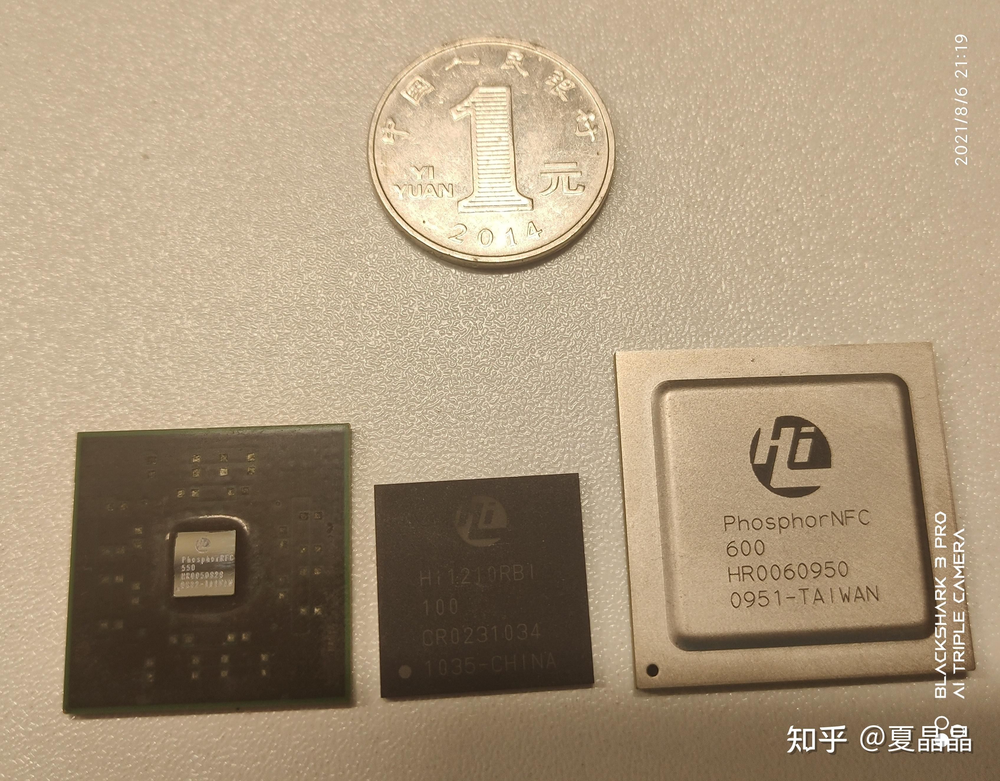
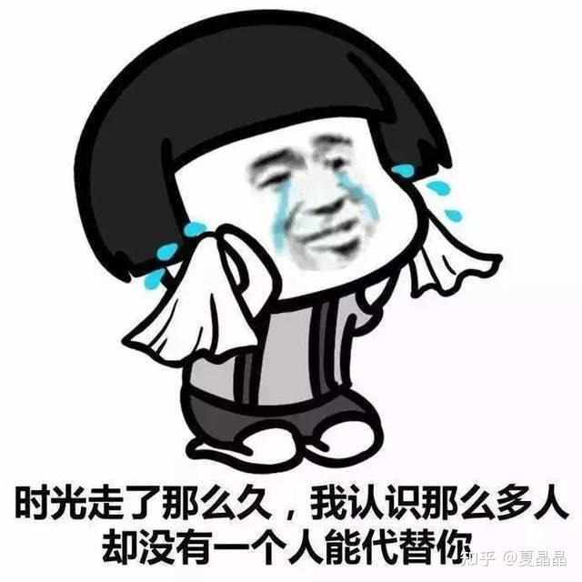

# 一生最重要的四颗芯片

> **类型**: 文章
> **作者**: Dio-晶
> **赞同**: 406
> **评论**: 23
> **时间**: 1628268283
> **原文**: [https://zhuanlan.zhihu.com/p/397183877](https://zhuanlan.zhihu.com/p/397183877)

---

今天又有一位故人考勤截止了，就如我隔壁的宁宁感慨，“一晃，就丢了，找不回来了”。

嗨

想起前两周鲲鹏的初创团队喝酒，三十多人还剩二十多，两桌，看上去还不错，却不知再过八年还剩几人。

前几天发了个桌上美术馆照片玩，看到哔哩哔哩还有一位牛逼的同学把入镜的一排芯片点了一遍，挺感慨的，其实我桌上做过的芯片有二十来颗呢，不过是纯粹是封装尺寸排序来的。

[https://t.bilibili.com/h5/dynamic/detail/553969838236306925?share\_medium=android&share\_plat=android&share\_session\_id=88d02809-c0a5-41df-96e6-bad318b32c16&share\_source=WEIXIN&share\_tag=s\_i&timestamp=1628263560&unique\_k=8cW5wM](http://link.zhihu.com/?target=https%3A//t.bilibili.com/h5/dynamic/detail/553969838236306925%3Fshare_medium%3Dandroid%26share_plat%3Dandroid%26share_session_id%3D88d02809-c0a5-41df-96e6-bad318b32c16%26share_source%3DWEIXIN%26share_tag%3Ds_i%26timestamp%3D1628263560%26unique_k%3D8cW5wM)

但要按重要度来排序，我这一生最重要的四颗芯片，一颗都没有出镜（尺寸都太小）。

我觉得没什么保密泄密的说法了，都是十二年一个轮回之前的旧事了，也没多少人还记得。

最左一颗是phosphor V550，哔哩哔哩的同学翻译成“磷”，但正确的中文名是“启明星”，英语没学好可能是有些偏差（表面上这名字是我起的，其实是夏Y姐姐起的），哈哈(ಡωಡ)hiahiahia，这个bug就算是接头暗号吧，终会有一天，也会被人遗忘。这颗芯片对我的意义是：**十四年前，第一次担任芯片项目经理投的人生的第一颗芯片（出道了）**。这块芯片不是商用产品，用途就如它的名字启明星一样，这是海思第一颗65nm工艺探路的芯片，第一个超过1GHz的设计，以及还有其他一系列为XX准备的东西。芯片蛮顺利的，当年回片第一天，当天测试计划完成了，一看时间差不多晚上7点，嗯，测试日报一发，招呼兄弟们开心下班回家睡觉了。第二天被领导骂了半小时………… 题外话，这货唯一让我费解的是，敲破脑袋也想不起来，我为啥会做一个lidless 封装? 我当年是疯了吗？ 脑子是被门夹了还是进了水?

中间一颗是1210，嗯，有编号就是正规军了。这是**十三年前，第一次担任产品项目经理的第一颗商用芯片（出山了）。**这颗芯片让我学到了做架构师最重要的一个道理，如果不可避免要做A/B的trade off，那么对选定的结果A，在做的时候，一定要尽可能把A做到临近B的边界的极致。咋说呢，这颗芯片最大的成功，就是功耗和面积在当年技术的极致边缘，做到了wirebond封装，面积和功耗再稍微大一点点，就得走flipchip封装，那成本差别就不是一点两点。两美元啊，1.6W啊，你无法相信这芯片里面塞了多少东西。真是买不到吃亏、买不到上当。不过现在回想，好像傻傻的，虽然芯片发货量超过几千万，但是按结算口径下来，和很多明星芯片相比，没赚几个钱…………悲伤的故事

最右边一颗芯片，**phosphor 600，这是十二年前，鲲鹏三十二好汉结义，摔杯为号，从此揭竿而起的第一颗芯片（起风了）。**当年我负责了两个大模块和一个关键小模块的微架构和RTL coding，要分个座次我应该算第几? 5? 6? 7? 是非恩怨也分不清了。

我人生最重要的第四颗芯片是什么？ **下一颗。** 我这个人特别喜欢做下一颗芯片，可能是一种病，不知道为什么，每做完一颗芯片，3S的兴奋劲过后，就进入一种迷茫的贤者时间。我是谁? 我从哪里来? 我要到哪里去? 我为什么就做了这么个辣鸡（包括鲲鹏920和昇腾910）? 为什么还有那么多的遗憾需要弥补，这个微架构再来一次绝对可以做得更好，很好，这次肯定来得及，应该能做完美。

**是的，完美的下一颗（收官），兄弟，有始有终，一起做完，不留遗憾。**

ԅ(¯ㅂ¯ԅ) ԅ(¯ㅂ¯ԅ) ԅ(¯ㅂ¯ԅ)

为啥有种死循环的赶脚…………幸好年轻还可以浪

---

*由知乎爬虫生成于 2026-02-01 15:39:00*
