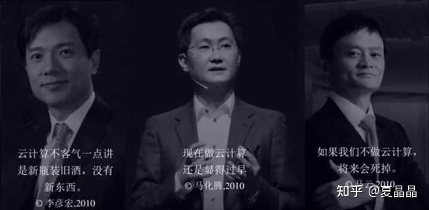
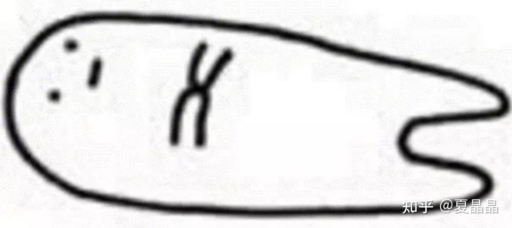
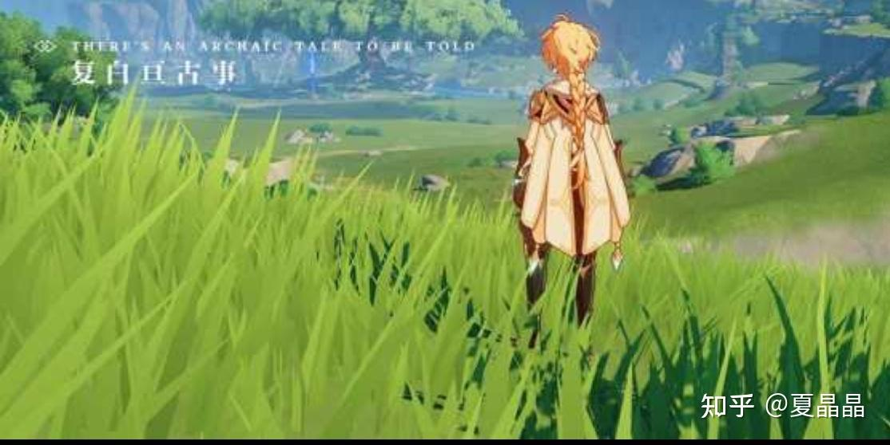
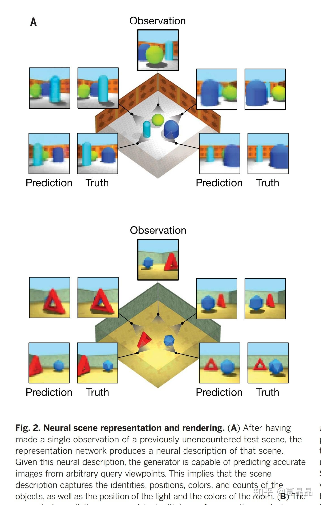
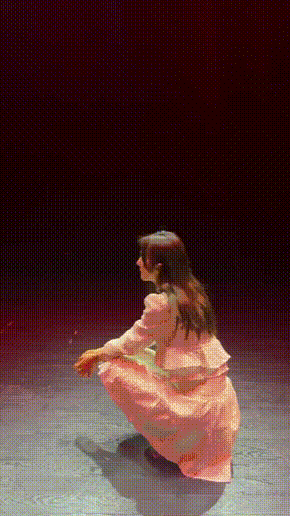

# 从GPU谈异构（10）

> **类型**: 文章
> **作者**: Dio-晶
> **赞同**: 116
> **评论**: 31
> **时间**: 1627800992
> **原文**: [https://zhuanlan.zhihu.com/p/395116480](https://zhuanlan.zhihu.com/p/395116480)

---

噢，metaverse……

<https://zhuanlan.zhihu.com/p/390591422>

上一篇提到了一件事，当前的GPU算力，离实时渲染出一个足够真实的大场景，有两万倍的算力差距。

那么正确的答案是及时止损，还是？

想想当年的云计算(￣ε(#￣)

要解决算力不足的问题，其实很多人都看到了，说得最多的topic是端云协同、以存代算。

端云协同想法很简单，云侧不足，用端侧来补嘛。其实纯粹是瞎扯，端侧算力要是够看还需要上云? 这还不是关键，更重要的是，云渲染要做好，是要保证能够无处不在的，metaverse要能用VR玩，也要TV能玩，也要mobile能玩，这端侧的各种设备算力差异性如何统一? 当下连个视频流编码都没法统一，还想算力协同? 想多了（未来云边协同倒是有一点可能）。

已存代算就跟邪乎了，逻辑倒是很简单，不同的用户，看到的远处的云啊、海啊、山啊，都是一样的，算一遍就好(✪▽✪)。 话倒是没错，但问题是，我玩的是万人团战，你以为我的注意力是在欣赏山、海? 还是在盘算如何用三十米的大刀砍死面前的一群沙雕?

端云协同、以存代算，都是路径上的奇技淫巧，算法级别的改善，而不是算力级别的改善。

那么，我看到的答案是什么?

上一篇很多同学已经给出答案了。

这个世界是不是可计算，那是上帝的答案。

我们要做的是metaverse，不是matix。

我们是人，我们只需要创造一个给人娱乐的世界。要卑微，创造完美世界的事情交给神去吧。

欣赏一下：【哔哩哔哩】[https://b23.tv/YQKRxz](http://link.zhihu.com/?target=https%3A//b23.tv/YQKRxz)

不理解这个感觉的同学，也没法读懂原神，还是不要做metaverse的好（最初的metaverse大概率是二次元起手的，为了低算力开销）。

**解决metaverse算力答案一：per stage AI化**

intel有一篇帖子，可能很多人没有注意。intel很多年没有做disceted gpu，Raja做Xe的时候，很多人也不以为意。但是这篇帖子，我认为很清晰讲述了Raja未来如果弯道超车nvidia的路径。

[https://coreteks.tech/articles/index.php/2020/09/27/intel-graphics-odyssey-pt-1-the-ai-gpgpu-is-a-game-changer/](http://link.zhihu.com/?target=https%3A//coreteks.tech/articles/index.php/2020/09/27/intel-graphics-odyssey-pt-1-the-ai-gpgpu-is-a-game-changer/)

太长不看，就截取一句话：**Neural rendering is the only evolutionary path possible in this post-Moore era.**

如果shader算力随着摩尔定律和并行化还能持续提升，那当下GPU架构中最大的瓶颈其实反而是fix pipe部分了。嗯说得就是你们俩，rasterization和tessellation。

依照帖子的思路先怼tessellation，这个复杂的单词翻译成中文就是曲面细分，解释一下，石匠是怎么雕刻一个狮子出来的? 你砍一刀，再砍一刀，再砍一刀，一刀一刀精雕细琢的过程，就是曲面细分了。这个tessellation，当前的GPU架构都是FIX PIPE，但是，但是，大家不是特别喜欢用，因为通常一个GPU，tessellation的性能只有6 primitive per cycle，为什么？ 因为硬件很难提升，如果不考虑算法压缩，一个三角形primitive有三个FP32浮点坐标，这就是96bits，6个这样的primitive的数据位宽就需要576bits，routing难度大啊。在硬件设计上，这种东西的scaleup空间是很差的。

intel的解决思路巧妙而又直接，graphic的每一个stage都是一个独立的function（mindspore看过来），对于graphic这种数据流动为特征的架构中，每一个stage都可以无隙地嵌入一个NN功能，按照intel的路径，原算法和NN算法并存，同时计算，如果原算法结果与NN结果一致，这可以降低原算法的算力需求（偶尔抽样），大幅通过NN提升算力。

举一个例子，守望屁股。

众所周知metaverse里面的屁股都是圆的（不圆没人玩），那既然是圆的，何必再用tessellation去曲面细分成圆呢？ 画圆天生就是一个可微函数而已。

再举一个例子，原神的草地。

这种东西，你能分辨用tesselation画和用NN画的差异吗？

甚至于，AO、super-resolution，都是可以想象的空间，**万事不决AI化**！

**解决metaverse算力答案二：Nerf**

老规矩，起手一篇帖子拍出来。

[https://deepmind.com/blog/article/neural-scene-representation-and-rendering](http://link.zhihu.com/?target=https%3A//deepmind.com/blog/article/neural-scene-representation-and-rendering)

基于NN的多视角场景表达和渲染。

原则上这是有一定成熟度的技术了，很多体育节目，例如：【哔哩哔哩】[https://b23.tv/DKqTen](http://link.zhihu.com/?target=https%3A//b23.tv/DKqTen) 都采用了这样的算力。

看一遍很容易理解，也很简单，万人同服，万人国战，有一万个视角。那么需要每1/60秒渲染一万frames吗？ 答案很明显，不是，只要明确了关键视角，如果还有一定原模型的polygon做补充，结果很可能就是只需要渲染100 frames per second，然后通过NN生成另外的9900 frames。

**解决metaverse算力答案三：taichi**

不解释，先看下图。

这其实是一个典型的可微编程，用低算力拟合出来的一个效果。

看完什么感觉， 真实? 不真实? 是否符合牛顿三定律?

我不得不再澄清一下我的观点，我们要模拟的是metaverse，不是matrix。这代表什么？ 代表的是metaverse的作者，假设是我，那我就是metaverse的上帝，所有的物理规律，包括速度、引力力、流体，都只有我有最终解释权。在metaverse的世界，大概率并不需要完备的物理仿真。

火焰 效果怎么算?

算啥啊，算就给你一个**佛怒火莲！**

不真实? 需要真实吗？ 你在现实社会是一个弱鸡，为什么你躲到metaverse的世界还假设自己是弱鸡呢? 你是李白！你是韩信！你的队友才是弱鸡，你十步杀一人，千里不留行。充值之后1v9才是你真正想要的。

taichi编程范式，是模拟metaverse中各种效果最佳的神器。

其实上一个帖子有不少人说得对，用欺骗人眼的魔法，是实现metaverse世界算力的唯一路径，而这个魔法，是**AI+Graphic**。

这个思路在我心中建立很早了，大致是在写下面这个帖子期间。

<https://zhuanlan.zhihu.com/p/332291332>

但是我非常非常奇怪，就是一直没有看到一个AI公司走向CG这个方向，寒武纪、我司、依图、商汤，要么在CV领域把技术问题卷成政府关系问题，要么在自动驾驶领域被罪恶感卷成L2.999999……。

要知道，AI的正确率问题在CV和AUTO领域都是大问题，但在CG领域，根本就不是问题啊。

我一直坚信，AI能够发挥最大能效和用处的，也是最有变现空间的，就是CG啊。

DLSS，没错，这是AI-CG的一个成功范例，但我认为，这仅仅是一个开始，一小步而已。

嗯，期待壁仞、沐曦、摩尔线程有点不一样的东西吧。 (๑˙ー˙๑)

嗯，也可能我的这些判断都是错的\_(:з」∠)\_

---

*由知乎爬虫生成于 2026-02-01 15:39:00*
