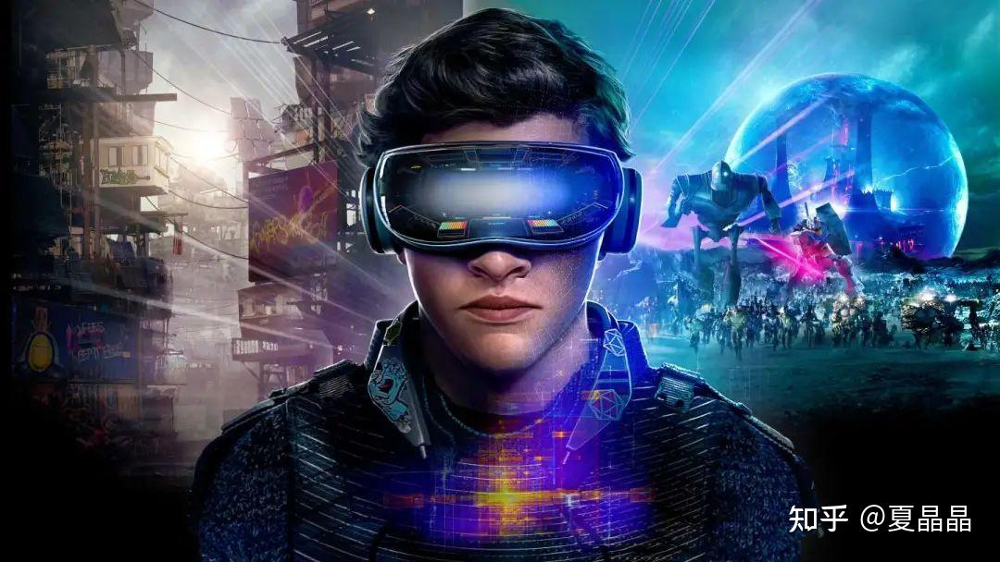
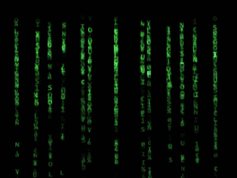
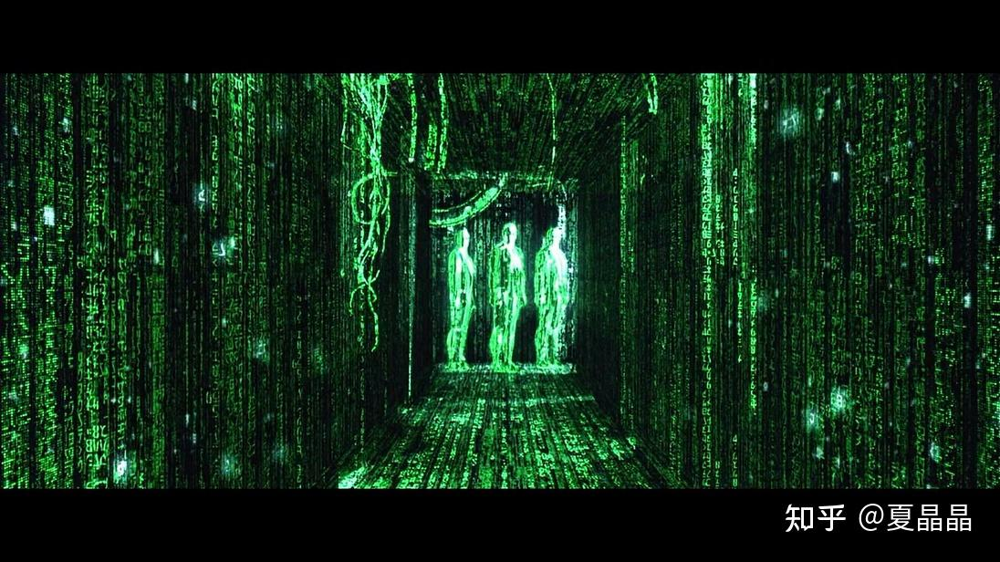
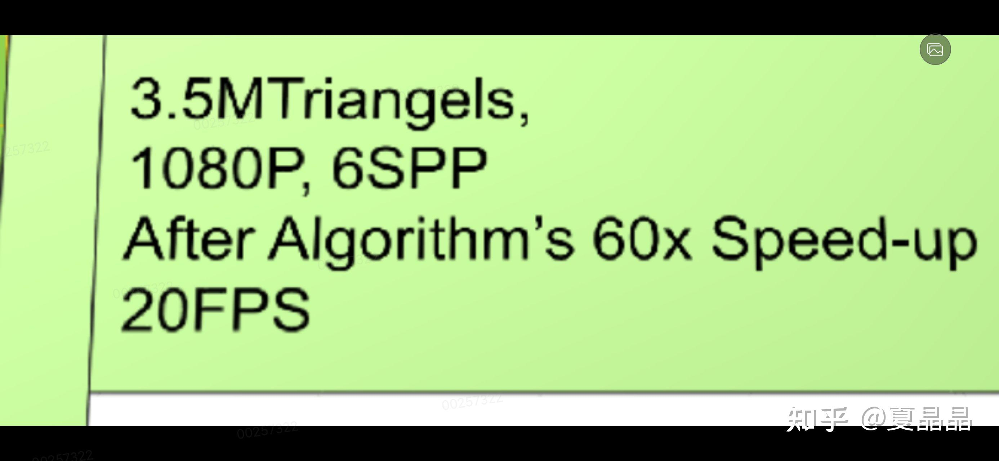
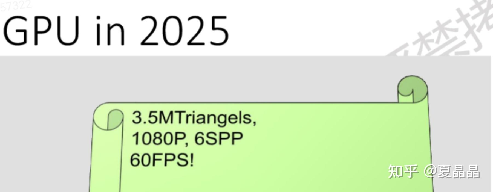
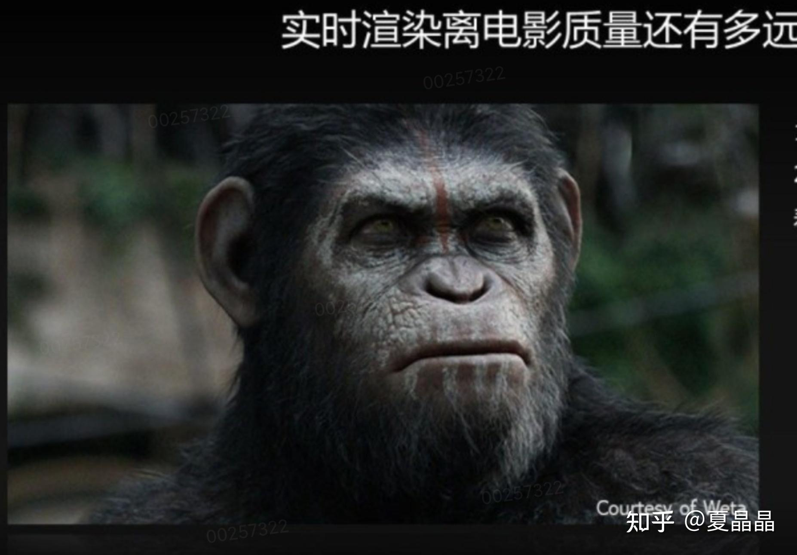
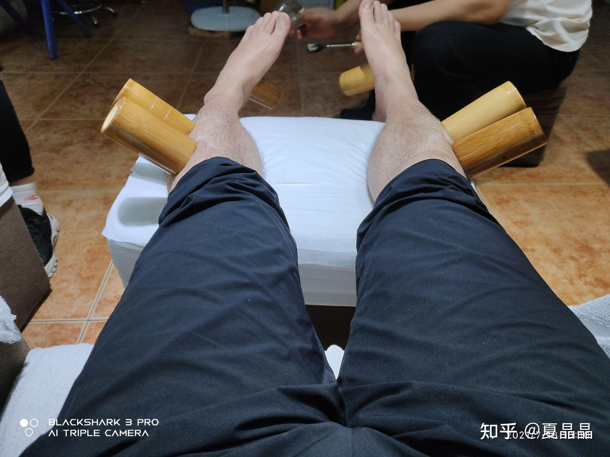

# 从GPU谈异构（9）

> **类型**: 文章
> **作者**: Dio-晶
> **赞同**: 75
> **评论**: 26
> **时间**: 1626574428
> **原文**: [https://zhuanlan.zhihu.com/p/390591422](https://zhuanlan.zhihu.com/p/390591422)

---

不知道因为啥，讲着讲着GPU就跑题跑到risc-V去了，不得不说偏得挺严重的，还是赶紧回到正题。

过去几年我的主业是做general purpose CPU，去年开始很认真地兼职做GPU。如果抛开号称什么都能做的GPGPU，从领域来讲，GPU cover的范畴包括了AI、graphic、HPC。

AI的部分在菊花以昇腾处理器为承载，做了这几年也是感触颇深，但也因为各种纠葛，留以后再说吧。而HPC，嗯，逐渐变得不能说了，嘿嘿。所以后面还是认真讲讲graphic吧，这事在未来几年存在着巨大的不确定性，看上去将是一个巨大嘴炮战场。

嗯，说得就是Metaverse。

这波热潮是随着roblox的上市而涌现的，钱嘛，不寒碜。但大概率过两个月就会回归一定的沉寂，毕竟嘴炮解决不了问题，而roblox终究是个以十二岁以下穷逼小朋友为主的游戏，直到，某些技术的沉淀、酝酿、爆发……毫无疑问，这个舞台，我不应该是个局外人。

包括知乎、微信，以及我菊内部论坛，都有不少讨论metaverse的，像下面这个链接也是。但是，从技术面上，看来看去都有那么一点不务正业。

[唐杉：元宇宙（Metaverse）的关键技术挑战有哪些，是否有可达的路径？](https://www.zhihu.com/answer/1904691818)[Morris.Zhang：元宇宙（Metaverse）的关键技术挑战有哪些，是否有可达的路径？](https://www.zhihu.com/answer/2004074603)

嗯，我菊内部的同学也差不多，洋洋洒洒写了一大堆关于如何在metaverse建立一个商业生态，如何通过提供开放环境引入内容开发，建立类似比特币一样的逻辑体现虚拟事物的价值让用户消费。还有人叽叽歪歪半天，讨论如何解决云端渲染和用户之间的网络延迟，保证用户良好的体验。上面这个帖子，也画了大量篇幅在着力阐述要通过AR/VR甚至手套为用户提供刺激的人机接口。

**就没有一个人正面回答：如何模拟一个与真实世界相似的虚拟世界。**

其实这是一个深入灵魂的问题，中国人民从庄子梦蝶时就已经提出来了，我们的世界是真实的还是模拟的?

这个世界上应该有两类人对这个问题最为敏感，一类是物理学家，一类是计算机图形工程师。如果你能换位思考，你一定能感受到，他们都在无时无刻地想要寻找这个世界的破绽。

用计算机图形学模拟一个完整的世界，是所有学习计算机图形学人的最永恒的终点。

不，其实这是每一个计算机体系结构从业者的终极理想。**计算的终点是什么? 那就是，这个世界是不是可计算的（这甚至是一个哲学问题✪ω✪）。**

好吧，不要过于放飞自我，先回到这个世界能否用计算机图形学模拟。我们是做GPU的，就好好想想GPU行不行，而不是去扯什么经济上行不行、延迟行不行，想太多。专业的事情交给专业的人去解决，我也算半个网络专家呢，我也不想在这里谈延迟行不行，我跟你讲，行，有路可行，但是那是另一个话题和技术范畴。

简单来讲，通过计算机图形学模拟一个世界是可以的，这一点在无数的电影中已经实现了，最震撼的莫过于iMaX版本的阿凡达，如果能建立一个阿凡达级别的虚拟世界，那么metaverse就已经实现了。但事实上不能，因为电影是电影，他和一个真实世界最大的差异是时间和视角。

电影的渲染是离线进行的，他可以用数个小时来模拟一秒钟，并且它的视角也局限在它展示给用户的固定编排。所以电影永远是电影，它可以算上帝对某个世界的过去的窥视，而不是生在当下的真实感知。

**metaverse需要实时渲染。**

计算机图形学画图的流程，几十年来都已经差不多固化了。先是用很多的三角形建模，只要三角形足够多，那就能建出一个圆润的球体，然后把大概率预先就备好的肉色图纸贴在球体的表面，然后打上灯光，曲面的镜像反射和空间的漫反射结合成青春和夏天的气氛✪ω✪ 大家就可以健康快乐地玩沙滩排球了哇。

当然这两年也有一些新技术在颠覆一些算法，例如直接的primitive as triangle，以及考虑直接基于ray进行反向渲染（毕竟人看到的东西就是眼睛射出的激光束最终反射到光源的过程）等等……

但无论如何，目前的计算机图形学无法避免tirangle和ray两个重要的参数，两者的数字越高，渲染出的图像在用户肉眼接收时感受的结果就越接近真实的世界。

**要达成metaverse（头号玩家）级别的虚拟世界，需要怎样的算力?**

我用ray这个单一参数来举例一下，前AMD fellow杨建，去年在菊花的技术峰会也是举的这个例子，后来做凤凰引擎的李宏伟也是用ray做例子，他们在业界都是资深人员了，拿他们背书，我抄答案大概率就错不了，避免了对某些参数估算的争议。

NV去年的RTX 2080TI的ray tracing能力是10G rays/s（手机最多也就做1G rays/s），这里还隐含了每个ray需要计算的包围盒求交和三角形碰撞次数参数（先省略）。下图是杨建的无修原图，如果按照3.5M个triangle的模型，1080P分辨率，6 samples per pixel，隐含参数大概是3-5次bounce，10个左右光源。 最终的结果是20FPS。

然后杨建预测了一下五年后，按2nm工艺的GPU的能力，大致能做到60G rays/s。

他很失望的说，即使按照60G rays/s算，只能做到下面这个结果。也就是上面的基础假设不变，做到实时显示要求的60fps（原图无修，有疑问找杨建）。

一个真实世界，3.5M triangle是远远不够的。

要达成如下这张图的效果，先不说三角形数量、毛发数量、毛发飘逸时的物理行为计算，只看ray，需要多少算力?

李宏伟算的，大佬背书我照抄。

**1920列 \* 1080行 \* 500spp \* 7bounce \* 50光源\*60fps = 21T rays/s算力。**

不多。

不考虑互联和分布式计算的损耗，2万张RTX 2080TI卡的算力。

答案就是，如果要玩到头号玩家接近效果的metaverse游戏，每个用户需要2万张2080TI卡。

……我有这卡，去挖矿它不香吗？

我感觉啊，大致也就是算完这些数字之后，杨建大佬看上去就一脸遁入空门的样子离职了，放弃了多年积累的graphic，去沐熙当CTO做HPC玩物理学找世界的破绽去了。后来李宏伟也走了……嗨。

差距很大，坦白地讲，短时间内要弥补如此巨大的GAP，几乎是不可能的。

但是，我还是那句话，正是因为有巨大的障碍，那第一个翻过这个障碍接近目标的人，才会获得更大的奖励。

**弥补这个GAP有没有方法? 有!**

**metaverse未来几年有没有机会实现? 有!**

下次洗脚有心情再码字<(\*ΦωΦ\*)>

---

*由知乎爬虫生成于 2026-02-01 15:39:00*
