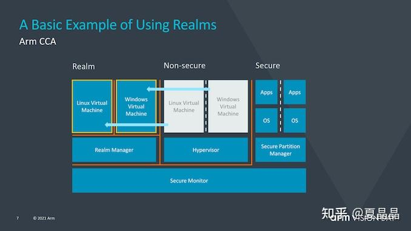

# 从GPU谈异构（8）

> **类型**: 文章
> **作者**: Dio-晶
> **赞同**: 193
> **评论**: 41
> **时间**: 1624768307
> **原文**: [https://zhuanlan.zhihu.com/p/384367176](https://zhuanlan.zhihu.com/p/384367176)

---

嗯，前几天突然有人问我，你聊GPU就聊GPU，干嘛突然扯上RISC-V CPU ?

⊙ω⊙

是啊，怎么扯着扯着又涉及到我CPU的本职工作了? 这突然让我隐约嗅到一丝危险的气息。

最后写一把RISC-V就收手，写GPU、GPU……

一个问题：**RISC-V的商业模式是怎样的?**

最近RISC-V大会刚刚结束，身为歧视链末梢的疫区码男，即使一周三捅，也只能遥远地吃个瓜。

但是我看这次大会虽然吹牛逼不少，但在RISC-V商业模式上讨论得并不多。这么大一个事情，要成，一定得有一个能让参与者健康、长期地赚到钱的ecosystem，才具有可持续成长壮大。

**首先：RISC-V在CPU的设计和修改的难度上是比传统CPU要低的。**

过去我们看到intel的CPU甚至ARM的CPU时，对其复杂度和难度是具有巨大的敬畏感的。芯片业者通常也一致性地把CPU的设计称为皇冠上的明珠。

这里不得不说一下所谓指令集复杂度，正如Jim keller也说：“RISC-V处于复杂化生命周期的早期，拥有核心功能，没有太多”垃圾“”。

请问，他说的“**垃圾**”是什么?

在他原话中提到了浮点、向量、64位，这是垃圾吗？ 不是。你做一个ARM CPU，现在是不需要考虑32位兼容，也不是必须要实现SVE或NEON向量指令的。

真正的“**垃圾**”，是在compatible上因为历史原因而背负，不得不支持，**代价巨大**的特征。

X86和ARM ISA上真正的垃圾，是因为近十年来云计算兴起而不得不为其IaaS模式而定义的**虚拟化和安全**。

艹，感觉真的在讲我的本行知识了。

所有软件人员都默认，一个高性能CPU肯定是支持虚拟化和安全的，ARMv9升级的一个巨大特征就是安全，但是我们有没有想过，对于个人使用者来讲，你算一个matlab，这些虚拟化和安全特性价值是什么？ 是负担啊。

**一句话：在当下的高性能CPU设计上，有～50%设计复杂度是消耗在虚拟化和安全特性上（ARM的中断控制器GIC甚至有80%设计复杂度在虚拟化上）。**

**第二句话：当前这些以云计算为目的的虚拟化和安全特性，都是为IaaS这种共享单车模式的云计算特征而诞生的（还有vxlan），想一想，如果十年后，云计算的模式转变成理想化的severless或者说disaggregated，即算力并不是按用户销售而是像水、电一样像资源一样售卖，云基础设施的CPU上的虚拟化、安全、以及vxlan，还有存在的价值吗？（说明一下，虚拟化和安全在前端控制分发节点肯定需要，但后端计算节点，大概率就不需要了）**

如果我们直接面对十年后的云计算数据中心，一个heterogeneous & disaggregated的硬件设施，虚拟化和安全，都将成为X86和ARM沉重的包袱，食之无味，弃又不能。which ISA is winner ? 只能ARM+RISC-V组合啊。

RISC-V大幅简化了一个高性能CPU的复杂度（光虚拟化和安全就是50%起步了），这也是为什么包括包云岗老师的香山CPU在内，还有PULP CPU系列群等等，有那么多的开源CPU能够纷纷出现，并且已经性能也逐渐存在与主流高性能CPU一较高低的原因（当然包老师他们也很厉害）。

RISC-V的简化意味着放弃一部分domain，这也是RISC-V是一个合适DSA的平台起点的原因。

<https://zhuanlan.zhihu.com/p/376409878>

最后吐槽一下IaaS下的虚拟化、安全、VXLAN，你看看ARM为了在IaaS下的安全，在ARMV9加了多少状态转换（下图）? 这复杂度，需要多少设计和验证? 值吗？

**CPU设计的简化和RISC-V的商业模式有关系吗？ 有！**

先看一个问题，这次RISC-V大会发布的来源香山处理器。包老师希望让开源处理器变成处理器领域的linux。开源处理器设计是RISC-V未来的商业模式吗？

我认为**不是**。

开源ISA != 开源CPU

开源CPU是学术圈的一厢情愿，不能让参与者赚钱的行业永远不是好的行业（当然包老师他们也很厉害，证明了一个也很重要的事：做一个高端RISC-V CPU没那么难）。学术圈当然有很多雷锋，因为学术圈求的不是钱，或者说不是明面上的钱。但是当前的形式，与linux或者android面对windows的时代已经不一样了。处理器架构的演进也并不像OS那样模块化和具有继承性。

回看历史，X86、ARM、RISC-V，理解他们的差异和成功路径就能看到其可能性。

X86的CPU是一种IP深度定制的复杂设计，他的ISA及CPU及制造都是深度绑定的，他依赖的是IT设施的白盒化，通过系统的复用和分层战胜了SPARC和POWER。

ARM的CPU的本质是复用，通过产业链的重新分工或者说通过ISA-CPU-制造的解耦，让产业链的参与者都赚到了钱。

PS：港真啊，换一个角度来看的话，ARM其实是apple自家的设计部，TSMC其实是apple的IDM。apple和intel唯一的差别，就是intel是从一而终的好男人，而apple渣男第一天起就打算始乱终弃的（被apple玩完的依旧是大家跪舔的女神而已）。

所以，RISC-V的商业模式就是一句话：

**X86 CPU ～ IP dedicated**

**ARM CPU ～ IP reused**

**RISC-V CPU ～ IP customized**

**基于chisel的高层次语法高效率及ISA简洁带来的CPU复杂度降低，定制服务商可以基于客户的domain快速完成定制化设计服务，再通过MLIR快速提供用户可source code compatible的软件移植方案。**

为大客户提供贴身的定制DSA服务，这是一个走向差异化服务的时代。对的，“只要钱给够，皮鞭也罢、制服也罢，什么姿势我都会啊”，这就是下一波半导体的金矿了。

所以，你猜intel为什么基于IDM2.0，收购了拥有定制ISA能力的x280 CPU（闭源）并附送MLIR作者Chris Lattner的SIFIVE ?

X86+RISC-V，可能也挺香。

---

*由知乎爬虫生成于 2026-02-01 15:39:00*
