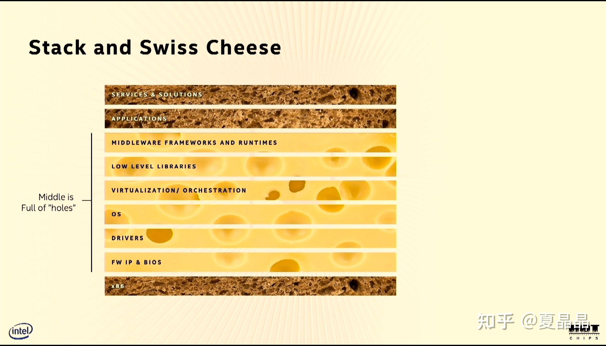
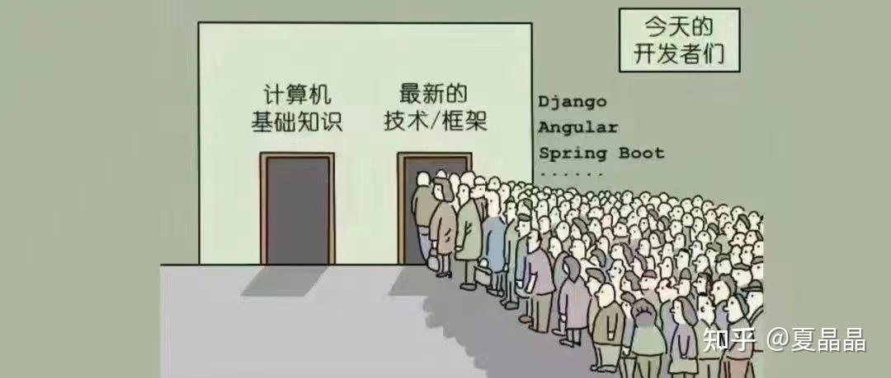

# 从GPU谈异构（7）

> **类型**: 文章
> **作者**: Dio-晶
> **赞同**: 102
> **评论**: 17
> **时间**: 1623650150
> **原文**: [https://zhuanlan.zhihu.com/p/380503615](https://zhuanlan.zhihu.com/p/380503615)

---

本来这也是想在上一个帖子一并写的，但写着写着感觉有点长，很担心出现太长不看的问题，所以还是另起一贴。

毕竟，端午节是中华民族传统灌水佳节不是？

**如何实现一个好的DSA ?**

这里强调的“实现”两个字，就是真正做出来。

每个人都有梦想，出发点都是美好的，但真正能走到终点的，可能并不是很多。

**那么，要最终实现一个好的DSA的困难是什么？**

还是先无脑盲吹一把Patterson大神，我也不讲为什，你看完后面的逻辑，再来看看这神秘的微笑，谜底就在于，你有没有真正的理解他的智慧。

其实这个道理我也是最近这一年逐渐深入体会的

我的主业是做general purpose CPU，十几年了，有些事情一直在经历（或者说是收益），但一直没有体会到。就像氧气，呆在地球上可能无法体会其宝贵。

通用处理器发展了几十年，注意这几十年的说法，时间是一个很重要的因素，形成了一个复杂的多层（multi-layer）的层次化生态系统，每一层都对上和对下形成了一个承上启下的平台模式。我引用intel的大架构师RAJA的一页图做例子。

就如他所言，这些复杂的层次也代表着壁垒和偏差，并因此形成了性能损伤的气泡。这也是他推动oneapi的一个动机。只有打破这个蛋糕的层次，才有机会把软硬件的性能重新榨出油水，这也是做DSA的一个重大的驱动力，我想大家都懂。

缺点一眼看见，但是分层的优点有多少人真正想过?

这个分层的好处就是**解耦**，像我们这种死脑筋的硬件人员，在做CPU的时候，很多问题的思考都不需要太多的转折，因为通过数十年的迭代，这些层次之间形成了相当繁复但清晰的契约（我喜欢契约这个词），做硬件的并不需要考虑python怎么写好，只有做库的人交给做C的人，做C的人交给做JIT的人，大家各尽其责做到最好。

并且啊，还有一件更重要的事要明白，做蛋糕和分蛋糕，都不是一件简单的事情，这个几十年磨合出来的分层，让每一层的参与者，都分到了一个与其能力和贡献基本相匹配的利益。

也许你会觉得很瞎(ಡωಡ)

但是我的结论就是：

**要真正实现一个DSA，最重要的是避免内卷！**

**DSA话事人最重要的工作是定义好规则和边界（principle & boundary）。**

做DSA的同学们啊，不要一谈到Software & Hardware co-deign就兴奋，这是蜜糖，也是陷阱。一念之间，这事就能变成Software & Hardware co-involution（内卷是这个词吧?）。

软硬件全栈的垂直优化，固然会带来比现有体系更优的收益，但会急剧加大对象事物的复杂度，原本出于某个层级的同学被迫需要看到更多层级的特征和耦合关系，如果他不能他跨域的两个层级拉通来考虑问题，那么其解决问题的方法往往都会是片面的。

打破约束的自由度带来了无尽的可能性和变化，但也会模糊人与人之间、team与team之间原本的关系和认知，你得明白，每个人所受过的教育，经历过的历练都不尽相同，那么每个人出于其理解，都会对这个边界和规则的重塑有着各自不同的理解，这其中也许没有人有错，也许生物界的物竞天择就是如此…………但生命宝贵啊。

看过太多，软件与芯片之间、硬件与软件之间、系统与市场之间，太多太多的矛盾与冲突或者无法决议。

所以，要成功让DSA落地，一定得有一个话事人，能够将心比心，并且有能力站在各个层面将目标与能力融合，建立新的规则和边界，才能形成合力。

嗯，某些DSA公司，还搞什么双话事人策略的，哈哈，上一个这么玩的电影应该很多人看过，祝她好运。

哈哈，我觉得吧，我做ARM CPU架构师十几年，在我的领域算是公正公平完成了分蛋糕的工作，不知道领导咋看（啊，赶紧修正，差点引发误会，我绝对不要做DSA的话事人，我就是个最底层硬件的包工头，hold不住）。

再回头看看patterson教授，你得去努力理解他在DSA的黄金十年中，希望建立怎样的分蛋糕的逻辑（他一定不会告诉你）。MILR、chisel的利益链是怎样的? 为什么会有这么多开源的免费的core 代码出现? 他希望sifive卖给intel吗？

DSA，将引发整个计算领域的重塑，我也不知道会变成啥样，不过最后说句题外话，要想成为DSA的话事人，得进左边这扇门。

---

*由知乎爬虫生成于 2026-02-01 15:39:00*
