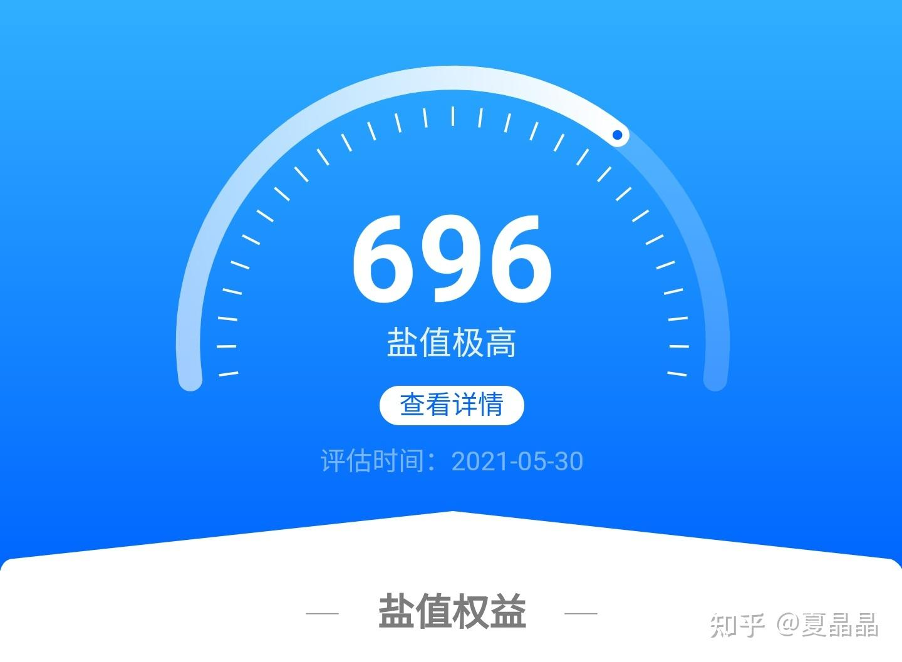
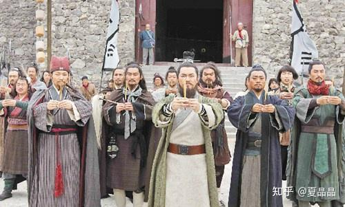
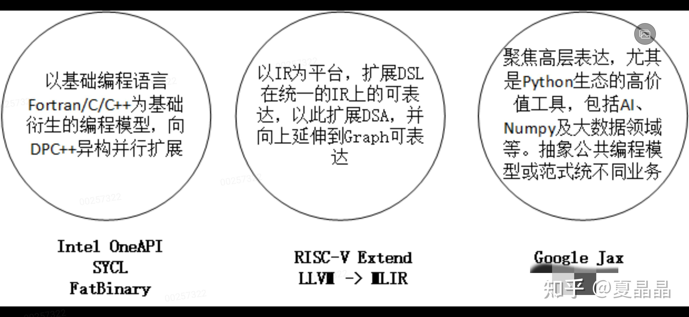
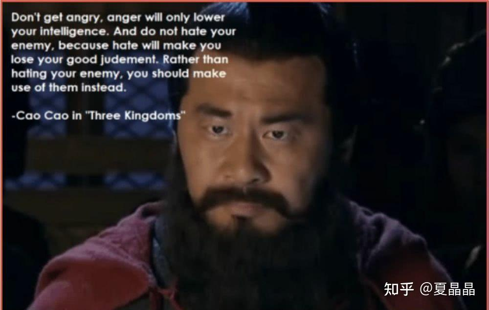

# 从GPU谈异构（5）

> **类型**: 文章
> **作者**: Dio-晶
> **赞同**: 139
> **评论**: 39
> **时间**: 1622960529
> **原文**: [https://zhuanlan.zhihu.com/p/378279761](https://zhuanlan.zhihu.com/p/378279761)

---

最近，每个荣耀赛季上了王者之后，没啥特别想法了，感觉王者荣耀需要再点吸引上分的诱饵啊，否则王者二三十星摩擦摩擦心态上比较鸡肋。所以今天还不如继续冲盐值分，最近写得很勤奋好吧，我就没搞懂为啥总是差一口气到700，这机制搞得比上王者还复杂。

写啥？

云游戏? 这个简单，晚点写。

metaverse? 最近这个词挺火，应该是roblox上市，市值超出了很多人预期。然后资本们就蜂拥而至了。

嗯，你看壁仞的唐杉同学突然来个突如其来的发问，无他，资本老师安排的家庭作业呗。

[元宇宙（Metaverse）的关键技术挑战有哪些，是否有可达的路径？](https://www.zhihu.com/question/461140182)

其实，连nvidia黄师傅也不能免俗啊，在最近的computex上也开始讲metaverse。黄师傅啊，你可是做核弹的，你的omniverse岂是roblox这么个只能勾引8-12岁穷逼小朋友的赶得上的，不要负了omni这么个霸气的名字啊。

要讲清metaverse，首先得把metaverse、omniverse、cyberverse、digital twins、parellel world、cloud gaming这些概念的定义、关系、未来，及一个完整的story讲清楚。所以今天先不讲……我感觉完成我菊领导给的家庭作业难度比VC的高，还没做完。

换一个大题目讲，异构编程框架。意不意外?

patterson大神到处宣扬DSA的黄金十年，嗯，无论你信不信，我在上一个帖子，努力地以我的理解把他想讲的硬件测的故事圆了一下。

<https://zhuanlan.zhihu.com/p/376409878>

开源+Risc-V+chisel+MLIR，但如果你真的这么走一轮，你会发现有一些东西，虽然间接地提到了，但不完备，缺乏一个理论上的指导思想，一个古圣级别的大计划。

**这就是：DSA编程框架，一个生态。**

这个问题很重要，因为光做一个DSA硬件不难，难点是要如何把DSA的特征正确地表达给程序员，毕竟这个世界上，软件开发者的数量几乎是硬件开发者的一百倍还多。

**C语言，是过去三十年软件和硬件两个阵营之间，签署的最坚实的盟约。歃血为盟，永不背叛。**

**硬件为C语言的语义提供了最能发挥其性能的silicon，而软件虽然搞了很多的圆环套圆环般的层次（说的就是Python），但最终都以C语言作为最后的沉淀收尾。**

**CUDA C++，最终也是回到C语言上扩展了CUDA的生态，来达成基于CUDA生态的异构编程。**

**但时代变了，我们需要一种能够更加普世的编程框架或者范式，吸引并影响更多的软件、硬件同志们参与到DSA其中，再次歃血为盟，为未来的三十年定下下一轮的契约。**

每一个IT公司都希望这份新的契约是以自己为中心的，所以他们都从自身所能掌控的生态出发，以期吸引更多程序员的认同。基于生态层次的划分方式，甚至于在当下战场中兵戎相见的某些公司，也不由自主地站在了一个阵营。

**东汉末年分三国，烽火连天不休…………**

**魏**：

intel为首的general purpose CPU，背负着前三十年的历史包袱，是包袱，更是财富，毕竟汉室正统，挟天子以令诸侯。所以intel继续从过去证明成功的C语言最底层表达继续出发，从最具群众基础的底层向上拓展，以期在原有的契约通过extension的方式再续三十年。

这不得不说一下DPC++，很多人都特别小看DPC++，据说我领导和SYCL的CEO面谈的时候问“这东西能提升硬件的性能吗？”，“不能”。这天就聊死了。实际上DPC++并不是为了提升硬件性能而存在，而是为了充分释放编程人员在DSA及parellel上的潜力而存在的。

知道CUDA为什么能成功吗？ 其实就是SIMT，这曾经是最适宜人类普世编程思路的并行范式，它把并行编程伪装成了串行编程，如果一个计算控制流不复杂，而显性地存在了同构的并发性，编程人员只需要按照自己的思路编写一个scalar的代码即可，SIMT可以自动帮你按32分组地展开成并发。这事提升硬件性能了吗？没有，但解放了编程人员的生产力。很多时候解放生产力比提升生产力更加重要，改革开放不就如此吗？ **DPC++在重复同一个故事。**你问为啥intel以前不搞? 因为intel在DSA的时代有了类似SIMT能力的AVX512，还有了RAJA搞出来的一堆XE架构，以前只能靠openmp和mpi，现在有新的机会逐鹿中原了。

魏国最大的弱点是什么? 是C语言开发者数量的逐渐式微，新兴的语言有了太多的语法糖（说的就是你，Python）。这些语法糖在解放生产力，的同时让开发者能力逐渐分层，吃惯了白面谁还吃红薯啊…………

～～～～～～

**吴：**

以Google为首，代表着从AI为创新源头的新兴势力。framework，即框架在AI领域的成功，让集中在这个领域的高密度人才携其创造的高密度思想结晶，希望像AI的泛化能力一样，把framework的思维方式泛化到其他编程领域。

framework最大的好处是什么，是信息的上传下达的尽可能无损。随着各种高层语言的层次不穷，为了最终适配原有的软硬件契约，语言在多种格式之间来回转义，就像中转英，英转法，法转日一样，来回一圈信息得损失多少? 所以很多人都希望最高层的信息能够直达底层。

当然，除此之外还有可微分策略。

**左手framework，右手Differentiable Programming，是这个流派最大的特征。**

一句话讲呢，这个流派希望破旧立新，重新制定软硬件的盟约，把C变成Python。

这个思路最大的优势就是这几年AI在framework和differentiable上看到的收益，前者能够打开窗口释放一波过去没有的高层次的设计空间，后者证明了一种新的方法有可能可以解决曾经没有解决的问题（典型就是谈的比较多的DSE，还有HPC+AI等等，以前都是硬算的，现在突然发现，我能猜啊，猜对血赚啊）。

说的都很好，破绽在哪儿？

1、framework其实代表着对一个领域的统一的高层抽象，AI其实就是比较清晰的数据流图框架，但是，并不是所有领域的框架都能用AI的框架完美替换，当然你说可以针对不同领域区别调整，但是这个领域够大吗？值得像AI一样定制一个tensorflow出来吗？ 真有值得的空间，早该有人做啦。

2、可微分这事，很神奇啊，低精度，猜一猜，高分辨率就出来了啊。其实也没有什么很神奇的，在我看来，一切可计算问题，如果自动可微能够拿到收益，那么必定是原本的计算存在冗余，或者原本的公式不完备，存在未能识别的隐变量，能够被可微分策略拟合出来。所以，这条路需要盘算一下，计算存在冗余及存在隐变量的空间又有多大?

3、其实这个问题最要命。这个世界的本质，是1%的天才和99%的普通人建立的，而生产力的本身，是这99%的普通人创造的，这是我身处99%太久而亲身体会，而那1%的天才往往对此并无感知。要提升或解放生产力，你必须针对这99%的常人，让一个方法更加普世、简单、易行。这个角度，往往是Google那1%的天才同学所忽视的（何不食肉糜呼）。

～～～～～～

**蜀：**

基于IR，分层的IR。以compiler为中心，让编程人员无感知地任意使用语言开发，用中间多级IR逐级构筑信息表达，硬件侧还是以C为基本面，通过IR的扩展性（dialect）来承载各层语言的语义无损，就像日本人和印度人最终通过英语完成交互一样（虽不完美）。

这个方向的描述在最近的asplos上，大神Chris Lattner已经讲得足够好了，如下：

<https://zhuanlan.zhihu.com/p/367035973>

Chris Lattner跳槽到sifive的时间不长，我也不清楚他和patterson是什么关系，为什么他们之间的故事就这样勾搭上了。但sifive是一个小公司，这么位大神愿意屈尊，肯定是有点我们所未能认识到的原因的。

这条路径，上能同吴，下能通魏，要说破绽，一个是IR dialect到底效果如何，还有待时间证明。还有就是，我感觉是力量太小，太分散，明显关张都未到位，还未能呈现出逐鹿中原的霸者之气，要是再有某些巨头突然加入，形势可能会有巨大的变数。

～～～～～～

**话说天下大势，合久必分，分久必合。**

但目前还未有迹象看出某个方向有大一统的趋势，还有得打。

～～～～～～

不过，还是想起昨天看过的一句话：

**万里长征三杯酒，千秋功业一壶茶。**

---

*由知乎爬虫生成于 2026-02-01 15:39:00*
