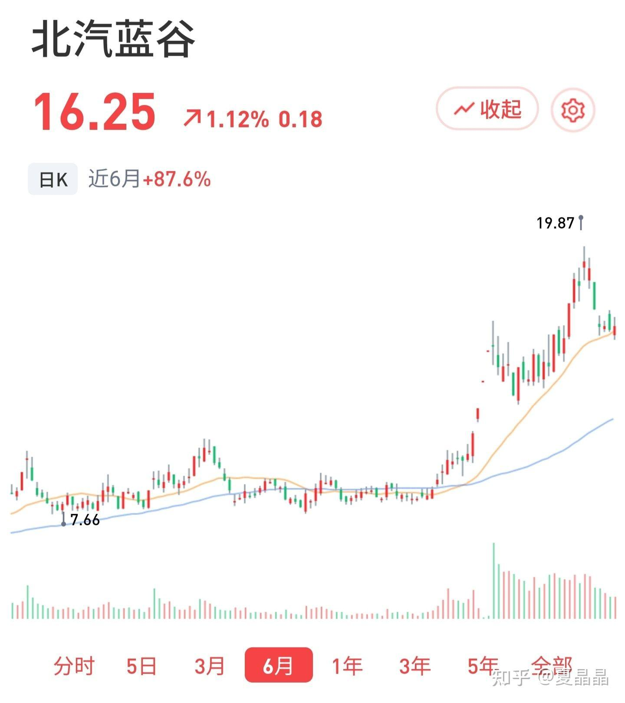
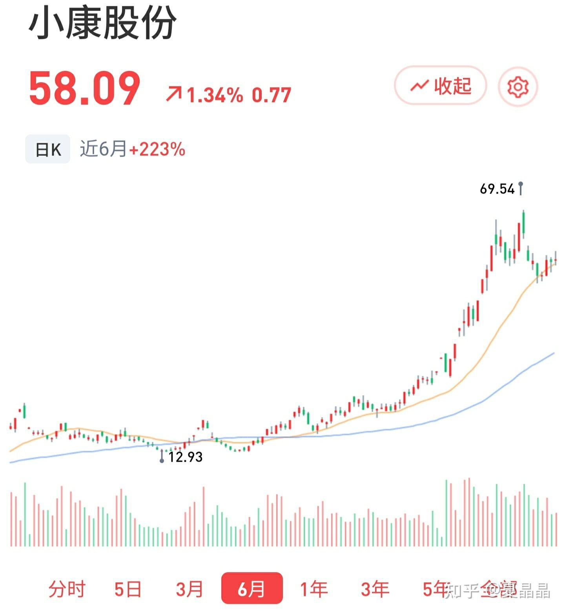
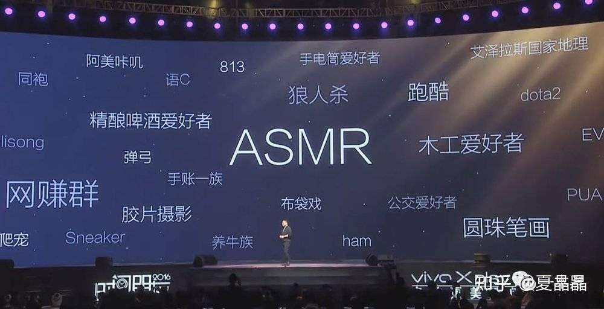
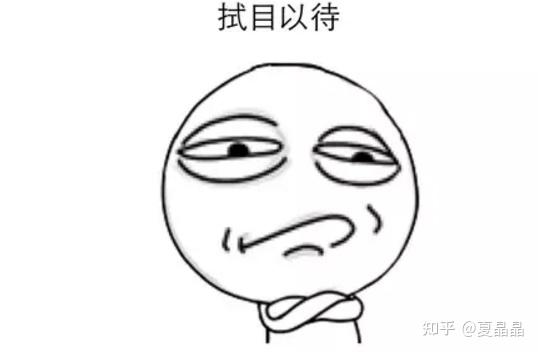

# 最后对自动驾驶胡说八道一下

> **类型**: 文章
> **作者**: Dio-晶
> **赞同**: 37
> **评论**: 22
> **时间**: 1622303381
> **原文**: [https://zhuanlan.zhihu.com/p/376342716](https://zhuanlan.zhihu.com/p/376342716)

---

最后逼逼一下自动驾驶就扯呼。原本是计划好好梳理一下GPU的思路的，再不认真都对不起申请立项被reject的PPT…………

为什么最近谈车呢？ 固然因为亲自参与了华为自动驾驶芯片的架构，更因为活久见，第一次感受了汽车与金钱之间的关系而震惊。

先上两只股票……

个人位低权轻，当然更多是因为穷，所以没法炒股。但是听那些故事再看到这两支妖股的时候确实有点颠覆认知。疯了，疯了。

看着两个百亿级别的公司，就因为和华为一起定制了两款车，股价就能三个月翻三倍。嗯，表面上很淡定，内心是方的……(#ﾟДﾟ)

倒不是觉得错过了赚钱的机会，而是深刻认识到，汽车这个行业，真的在洗牌。嗯，虽然和我架构师本身工作没关系，闲得蛋疼。

原本我看汽车市场的感觉是简单的内卷。

汽车和其他行业例如手机，是不一样。手机的变革，是跟随着2G、3G等公共资源建设变化而革新的，2G到3G到4G，相当于资源越来越充裕而产生了更多的变化，并承载了更多的用户。但车的本质作为交通工具没有变化的，城市的道路建设是有限的，不可能像3G、4G那样疯狂升级，即全世界承载的车辆总数受限于主要大城市的路政设施承载力，其实这已经接近于饱和，而车辆的平均售价目前来看也没有提升的空间，虽然说电气化带来了能效提升，但也就是个鲶鱼引发的内卷罢了。

但现在来看，好像不是内卷，这是洗牌，并且是一个商业模式的推倒和重塑的过程。

为什么说是洗牌? 简单一个问题，当下豪车的定义是什么？ 法拉利? 兰博基尼? OK，他们的特征是什么？ 速度快加速快咯。那么电动车出来之后，百公里加速这事你见还有人比不? 电动车不仅快，还有更多的电气化设备。此时要真说豪车，也就是我看到的某人买的进口版特斯拉了…………

一个行业环境，定价，以及层次化的定价是其健康度的体现，做大尺寸&低价格战不是。

那么这次汽车行业的洗牌，最终的胜利者是谁? 特斯拉? 电车三傻?

我认为，**胜利者是在洗牌过程中成功重建汽车行业从高到低价格体系或者说价值观的公司。**

唉，继续向下讲有点不好深入，不敢多讲，讲多了可能会被要求删帖，不过故事其实没离开我前面两篇帖子讲述的内容。整个逻辑中，确实，菊花的存在是蛮重要的。

传统车厂，重机械加工，在IT化智能化上存在破绽

我看到了据说有xxxx inside的logo将要出现。

上一个喊出这个slogan的是intel，这种slogan的意义在于通过垄断打穿了一层集成商，将本来用户不感知的器件商穿透设备商展现给了消费者。

AMD是万万不敢这么干的（想一想这是为什么），高通据说曾经尝试过，但最终失败了。

集成intel inside的是联想，但小米虽然讨好着高通，却始终不会贴出qualcomm inside的log，为什么？ 再看两者的利润率，细品，细品。

而当前业界，在intel inside事实下，又去掉intel inside的是谁呢？ AWS、Ali、MS、google……

一物降一物罢了。

拭目以待。

---

*由知乎爬虫生成于 2026-02-01 15:39:00*
