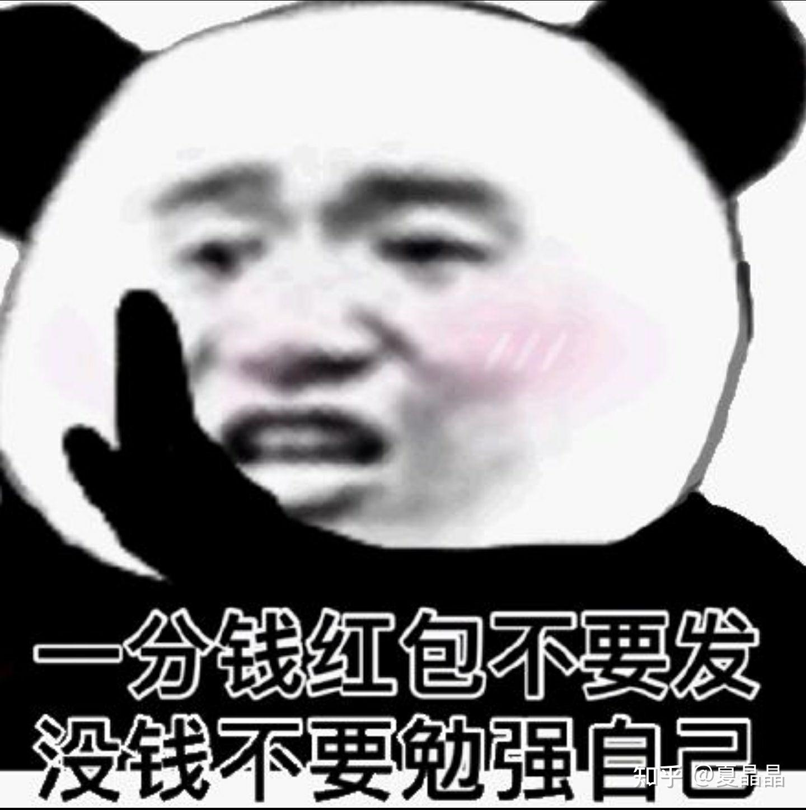
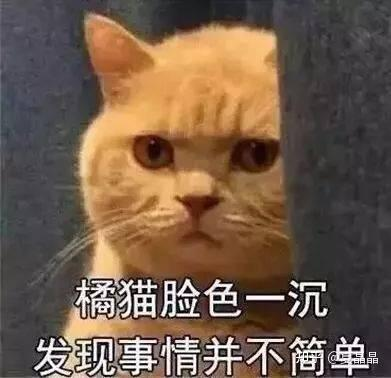
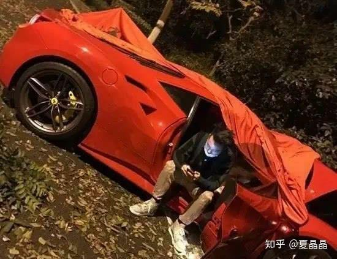

# 再对自动驾驶的胡言乱语

> **类型**: 文章
> **作者**: Dio-晶
> **赞同**: 58
> **评论**: 24
> **时间**: 1621001536
> **原文**: [https://zhuanlan.zhihu.com/p/372399032](https://zhuanlan.zhihu.com/p/372399032)

---

最近研究DSA……

patterson大佬曾经说，这是DSA的黄金十年。

近来越来越多人不由得发起疑问，说好的DSA黄金十年在哪儿(⊙o⊙) ? 为什么还没有到来。但没人敢直说，根本就没有DSA的黄金十年！毕竟还得和投资人谈钱呢……

其实并不是没有DSA，体系结构没有问题，问题是在这个畸形的世界本身。

投片太贵了，如果要做一个成功的DSA，你必须找到一个足够大的蛋糕（市场空间），毕竟杀人的生意有人做，赔钱的生意没人做。

当下这个世界上最大的DSA市场是什么？

**自动驾驶！**

**全新事物，全新的空间，所有的规则我来定义！**

站在汽车本身的角度，自动驾驶是在车之上的一个扩展功能。汽车的本质还是一个个人高效空间移动用的工具，自动驾驶的DSA增强让这个事物更加高效。

这是没错的，如果你见山还是山，汽车原本的属性就没有发生变化，自动驾驶是一个递进的革新。奥迪、奔驰、宝马大致上都是这么想的。

但你有没有想过最近的特斯拉事件，我作为自动驾驶芯片的ISO26262当下最大范围设计的初始架构师可以坦诚地讲，特斯拉很多器件是没有过汽车安全ASIL-D级别认证的，那为什么马斯克还能风生水起? 你得想想汽车是什么? 曾经汽车是我们重要的财富象征和跨阶的高效工具，但是在人家富二代眼里，2000W法拉利撞了也就是个响。为什么？ 因为如果汽车在个人总资产占比逐渐降低之后，其属性真的发生了变化，逐渐从重要的生产工具及资产变成一个玩具了，汽车的需求变得，要越来越炫和越来越好玩，玩具要那么耐操干嘛？

事物的变化也许不合理，但必有原因。

同样的故事，PC的发展、手机的发展，是不是都似曾相识?

曾经计算机也是企业级的生产工具，突然就放到个人书房里了。大哥大曾经也是财富的象征，然后呢？ 红米……

这也是为什么华为、NVIDIA等硬件公司纷纷入局自动驾驶的原因，引用菊花の大苏总的名言：汽车已经是一台个人电脑，而车辆行驶，只是这套电脑的一个APP的功能。原话不是这样，但大致是这个意思。

如果按照这个思路推演，汽车就是一个box了，XXX inside作为硬件的一种销售模式大家都已经看到了，此时，谁家的硬件做到性能越高，成本越低，其在价值链中可以获取的收益也就越高。价值链的中心将从机械转向IT设施（或者说芯片）

真是美滋滋的一个大市场。

如果事情发生到这里，确实就这样了。

但是，互联网的同学进来了……小米、百度都来了，阿里和腾讯还会远吗？

互联网公司的思考模式和大苏总一样吗? 不一样。

在互联网看来，车其实是一个人机接口，而且是以前一直没能挖撅的处女地，并且不同的车，用户特征也极其明显，直接可以获取大量用户特征。

最多两年，同学，你启动车辆的时候，显示器就会弹出淘宝或性感网游的广告…… 虽然右上角有一个跳过广告且54321计数的按钮，但你也不愿意去按它，因为你把握不准对方定义的有效点击范围会比显示出来的按钮小多少，一旦按错后果远比5S更加严重。

[先引用一下名言： 传统的车厂他的看法首…](https://www.zhihu.com/pin/1367145390513373184)

车辆与手机一样，具有极强的个人财产属性，在互联网视角下，车就是一个移动期间的个人娱乐中心。男人们加班回家，停好车不都在车里坐一坐再上电梯不是吗? 这个放松的时间在移动期间就完成了。

互联网思维下的自动驾驶硬件会是什么？ 和前面一样，还是一个计算机，但是，会是一个白牌通用计算机！ 当前计算机需要的基本部件都不能缺少！ 处理器、内存、硬盘、Android/Linux（我比较好奇微软咋想的，windows还要错过汽车OS这一波吗？）、以及必备的微信车载版、抖音车载版、头条车载版……

就像PC和手机发生过的一样，此时的汽车价值链条将从硬件转向软件，在通用开放约束下，IT设备不再是暴利但基于生态的高墙变得垄断化（也能赚钱），系统差异性变成应用为王，广告为王。

此时的自动驾驶还是DSA吗？

此时的自动驾驶芯片，将不再是千奇百怪的DSA，反而回归到general proposal CPU为核心的平台化设施，intel和arm建立的深厚生态将再一次发挥作用。**做CPU就是这个道理，无论你DSA前期多风光，最终都会回归大一统平化（规模化之后只有平台分层才能有进一步扩展空间）。**

不过真要走向互联网这个级别，可能还需要一点时间，需要自动驾驶真正解放乘客的注意力，还有，乘客不能晕车……

---

*由知乎爬虫生成于 2026-02-01 15:39:00*
