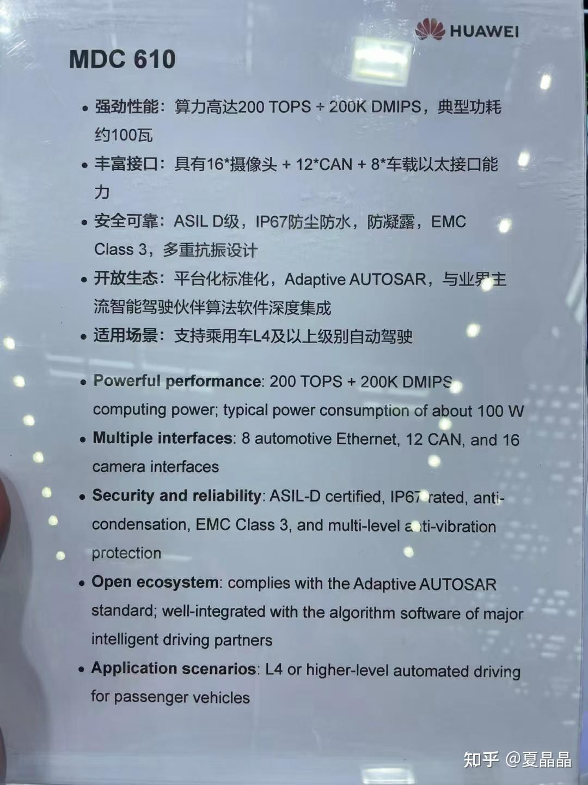
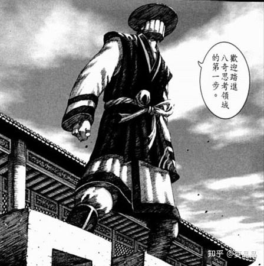

# 对自动驾驶的胡思乱想

> **类型**: 文章
> **作者**: Dio-晶
> **赞同**: 71
> **评论**: 12
> **时间**: 1619925082
> **原文**: [https://zhuanlan.zhihu.com/p/369356716](https://zhuanlan.zhihu.com/p/369356716)

---

陪小朋友上课，需要配合，不能打王者……

只能胡思乱想，今天是随意瞎写。

嗯，我菊也在做自动驾驶，MDC610…… 昇腾的编号是什么？ (ﾟoﾟ; ascend610么?

这芯片，哥也是architect之一，虽然只参与了前期较短的时间，对其中的知识结构理解也不深入，但因为哥画了第一版的架构图，从而决定了整个架构文档的配色！！！

哇哈哈哈，看过我昇腾鲲鹏架构图的同学应该都感受深刻，品味独特，犹如视觉污染，挥之不去。 (ಡωಡ)

装逼结束……

不谈这颗芯片及我菊的产品，谨慎谨慎。

瞎扯一下我对自动驾驶本身的一些很低级的迷惑。

自动驾驶分成三个部分：detecttion、perception、decision。即探测、感知、决策。

大家都知道，前两者当下做得是比较好了。

探测在于如何通过多种感官器件感知多种信息，用微波雷达、激光雷达、摄像头等获得，就如人的五感一般。只有特斯拉特立独行，强化camera一个点，打死不用激光雷达。不过从拟人角度来说也合逻辑，谁开车用鼻子嗅啊，专注视觉的好处是感知和决策可以更多地倾向于人的思维模式吧，瞎猜。

感知其实是CV+AI领域的延伸，不同公司在两者上有不同侧重，其中也有nividia直接怼上1000T的。此外就是数据的前融合、后融合之类的咸甜豆花问题。

决策上的问题我理解还比较大，当然我的理解不一定对，参与太少。决策环节确实有人在引入AI相关的算法辅助，感觉上还有待检验，特别是先验知识的收集和标注蛮困难的，此外AI计算要符合ASIL-D也有点难。所以主流我感觉还是状态机+决策树为主的样子，基于地图、目的、当前状态逐级分解，然后基于某种设定的weight选择出结果。其中的问题就在于weight上，如果延伸到一定高度，这个东西叫做价值观。再上升就是伦理了，如果没法刹车，左转撞死十人，右转撞死一人，如果决策? 即使不扯这么高深，cut-in也是极为复杂。我一直在寻找自动驾驶强行cut-in人车甚至逼停的视频，没见到。因为我理解这真蛮复杂的，五菱cut-in奔驰、劳斯莱斯cut-in比亚迪、进口车cut-in国产车、面对领导的车、面对夫人的车，该如何决策，那是环环相扣，一步错步步错，人心最是难测。

我一度认为这个问题是有解的，曾几何时，大家的出行工具都是马车，但也就五年不到的时间，内燃机几乎百分百地完成了马车的替代。相信很多startup都给VC讲过这个故事。(ಡωಡ) 。同理，如果触发了某个trigger，大街上70%~80%甚至更多的车都切换成了自动驾驶，类似于群体免疫的效果，所有车都遵从规则，各行其道，相互协商完成道路的切换，完美的世界。

但一个突发的问题打乱了我的逻辑，这车是华为的还是小米的?

草草草(ノ=Д=)ノ┻━┻

我们都玩王者荣耀，我们很多人都会付钱给腾讯加速器，这个加速器能够提升王者游戏流量的优先级，保证玩家上网时延迟最低，效果很好，直到大家都购买了加速服务……

**这转化成了一个公共资源争夺的问题，道路即基础设施是国家的，车是自己的，在可touch空间如何相比他人获得更多的公共资源，将成为设备数字化和智能化的第二个战场。**

就如同曾经内燃机车用百公里加速xxS为卖点一样(动力也是公共资源争夺的一种模式)，自动驾驶通用会变成以如何高效抢占公共资源为竞争力。

嗯，小米五代自动驾驶会宣称其如何蛇形走位在华为四代的汽车之间灵活穿插，华为五代则会发布一个漂移过弯吊打小米并且水杯不撒水……的秋名山圣地视频。自动驾驶竞速评测将成为未来车评行业新热点。

想起来特别魔幻，但这也许就是决策环节的未来。

瞎猜瞎猜。

---

*由知乎爬虫生成于 2026-02-01 15:39:00*
