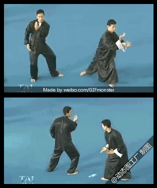
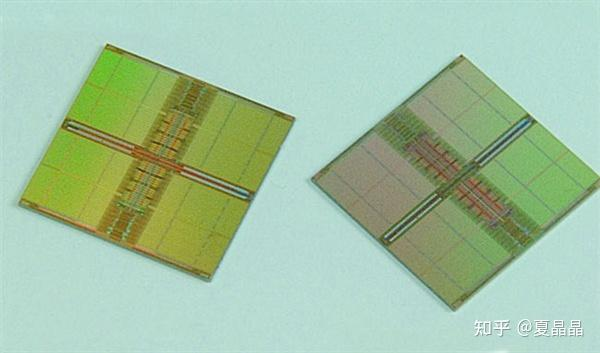

# 从GPU谈异构（3）

> **类型**: 文章
> **作者**: Dio-晶
> **赞同**: 164
> **评论**: 9
> **时间**: 1616910571
> **原文**: [https://zhuanlan.zhihu.com/p/360468817](https://zhuanlan.zhihu.com/p/360468817)

---

因为今天洗脚刚好回答了一个问题，顺带着这个方向展开一下。

[夏晶晶：NVIDIA为什么在游戏卡上死活不用HBM2显存？](https://www.zhihu.com/answer/1803789146)

做鸡（GPU）的人，在面对DRAM的生物多样性问题的时候，难免都是懵逼的。

GPU本身代表着异构，而异构本身就代表着多样性。如果是做CPU的人基本上精力都放在DDR上死磕，那做GPU，面对的是LPDDR、DDR、GDDR、HBM、甚至曾经的HMC，未来的3D DRAM。

选什么呢？

最直接莫过于价格，按最新主流算，LPDDR大致是$5/GB、DDR大约是$4/GB、GDDR算$9/GB，HBM得$20/GB。

一到这里，领导及若干个领导就会站出来。

领导提问：“你能不能用LPDDR做一个能替代GDDR的方案？ 这才体现了你架构师的水平啊。”

聪明的你只需要0.1S时间思考就知道正确答案有且只有一个：“可以的，没问题”。

**但命运馈赠的礼物，早已暗中标好了价格。**

第一性原理，颠覆性思维固然没错。但不能预设立场，DRAM vendor内的架构师都是傻叉啊。

你得先问自己，DRAM架构师是怎么考虑这个问题的。

DRAM foundry和TSMC这样的logic代工foundry还不太一样，DRAM的制造，原则上和银行印钞机差不了太多，用沙子印钱罢了。光机一开，黄金万两。

DDR是美元、LPDDR是RMB、GDDR是欧元，大抵就是这个样子，所以DRAM的architect一定是一个经济学家，天天都会盘算不同货币之间的折算关系，你说要是某种货币会大幅贬值，foundry根本就不会再印它。

这里，就回到了DRAM DIE本身的架构差异了。

如上图示例，绿色的规整大块是DRAM CELL，就像农田一样，正如农田都有田坎和道路，DRAM也是，为了获取访问农田的带宽以及为了3D堆叠更多的农田，IO和wire的开销是不可避免的，甚至于需要把农田切割得更加细碎。

物理化学的世界很简单，无论是更高的带宽或更低的功耗或更高的扩展性，你都得付出代价，这并不会跟随领导的主观意愿而变化。

GDDR为什么贵，量少价高固然是原因，更多的是，整个GDDR的 die，差不多一半以上的面积都是IO和走线，都得算钱的。

回到最初，基于DRAM foundry的产能良率最大甜点，无论LPDDR或GDDR，DIE都不会超过100mm2。

做一颗LPDDR，最新工艺大约能做到IO 16bit（按6.4G速率折算）12.8GBps速率下1.5GB容量 per Die。

做一颗GDDR，因为走线IO损耗，大约就只能做1GB容量，但IO 32bit（按14G速率折算）是56Gps带宽 per die。

LPDDR可以进一步叠多层，GDDR不能，但这并不重要了。因为die的基本能力已经决定了最大等价交换的空间。

不考虑GPU的IO数量差异，功耗差异，单纯讲替代。

如果GDDR带宽是560GBps（就是AMD RDNA2显卡水平），只需要10个GDDR DIE，共10GB容量，折合90$。

用LPDDR达到等价带宽560GBps，需要大约40个LPDDR DIE（当然合封之后不是40个颗粒），共60GB容量，折合240$。

**逻辑很简单，虽然每GB的价格GDDR是LPDDR的2x还多，但如果要用LPDDR达成GDDR同样的带宽，需要购买～5x的容量（折合～2x的价格）。如果最终～5x的容量确实成为了竞争力让最终客户能够买单，那么用LPDDR换GDDR就是血赚。否则这容量就变成了损失。**

写在最后，聪明的同学也会明白如何进一步答复领导的“可以的，没问题”了，如果这个GPU场景确实即需要带宽也需要大内存，那么血赚，作为优秀架构师你通过第一性原理思考完成了用LPDDR替代GDDR的方案，大幅节省成本，获奖感言的PPT都可以提前准备了。如果大内存价值低，那把多种方案详细用PPT列出来，让领导给出英明的决策即可。

---

*由知乎爬虫生成于 2026-02-01 15:39:00*
