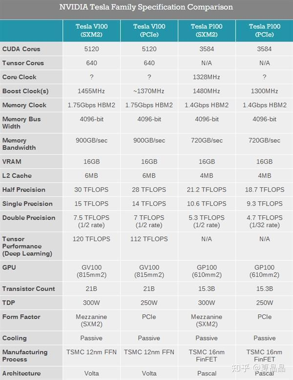
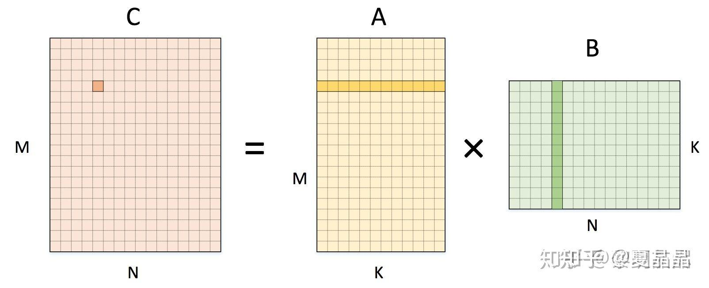
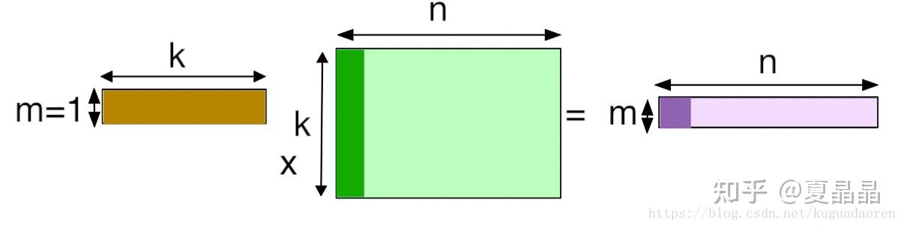
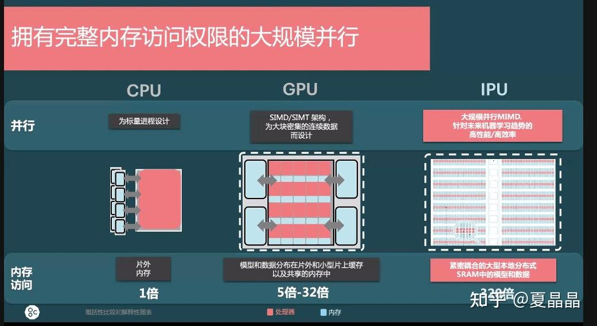

# 从GPU谈异构（2）

> **类型**: 文章
> **作者**: Dio-晶
> **赞同**: 122
> **评论**: 10
> **时间**: 1615642371
> **原文**: [https://zhuanlan.zhihu.com/p/356882307](https://zhuanlan.zhihu.com/p/356882307)

---

今天时间不多，就写个小case。

上一篇提到了AI与HPC的Flops/byte差异很大，在回帖上也激起了好几个角度逻辑，其实还是我没把逻辑讲清楚，展开再进阶说一下，限于能力有限，有问题也请继续指正。

第一个引入这个差异特征的是著名的炼丹神器nvidia的V100，我不知道大家第一眼看到V100的特征时什么感受，但对于一个传统HPC的人都会非常诧异，为啥半精度算力在cuda下只有30Tflops，但在tensor下突然就变成了120Tflops ？ 计算单元微架构的差异当然都能理解，但flops/byte凭什么能够改个MAC就提升4倍？除如果说CUDA的算力对HBM带宽配比是太低，NV架构师不可能那么蠢。所以，这个答案的差异就是来自于不同业务的flops/byte的差异了，tenser的算力是针对AI的。

我先把AI与HPC的精度差异放到一边，因为这个特征虽然也影响FLOPS/BYTE，但更多是算法源头带来的可计算可收敛差异。其次我们把AI的随机梯度下降（SGD）和HPC的直接计算及共轭梯度（CG）等计算收敛带来的差异也先放到一边，这同样也是更多是算法本身的收敛差异。 嗯，有空再专贴把精度和收敛算法做一下对比，这个影响其实也很大。

但如果专注到计算本身，我们就特定地看一下AI的卷积、HPC的GEMM和GEMV的差别，用图表达非常清楚，小学生都能理解。

这是一个单通道的卷积，卷积原则上不能用o（n3）来表示，而且他的循环展开在传统计算机体系结构上非常不好计算，所以往往会做一次img2col转换成GEMM的矩阵x矩阵，但为啥我写作o（n3+）呢，数一下蓝色矩阵第二行第二列的数字即可明白，这个元素在被filter卷积遍历的时候，复用的次数是filter矩阵尺寸MxN次，即通常巨大的左矩阵的每一个元素复用了右矩阵总元素个数次。虽然有时候filter尺寸不大，但抵不住AI还有巨大的channel尺度，即K个filter的常态，即左矩阵一个元素最终复用次数是MxNxK，复用率瞬间爆炸。

然后看看GEMM，如下，左矩阵A的一个元素的复用次数是N次，右矩阵B的一个元素的复用次数是M次。这可是cache设计上最喜闻乐见的计算形态了，但复用率也相比AI是降维的一个程度了。

如果在看GEMV，更惨，基本上所有GEMV无论是dense还是sparse，都成为了memory bound，vecter固然还有复用率，但消耗带宽最大的matrix，复用率为1。

HPC绝大多数solver都采用将计算分解为GEMV来进行，我猜其原理是在过去的CPU/MEM能力配比约束下最经济有效的解法。也许未来矩阵MAC形态增多，未来会出现更多矩阵分解的solver吧。

综上，AI相比传统HPC具有更高纬度的flops/byte，所以我们可以采用更加激进的MAC/MEM配比更高效完成AI的计算。所以，原则上讲，nvidia因为强调GPGPU的GP，导致tensor部分必须复用CUDA部分的load/store能力，所以NVIDIA GPU并不是最高效的AI计算芯片，这也是国内很多AI芯片公司有更进一步的可能空间。

除开计算本身的复用率（可以说是input reuse），神经网络本身的串行化结构导致了其output数据的temporal locality，如果能够有足够大的片上SRAM把layer N的output放下，并在提供给layer N+1作为input使用后丢弃（训练不能丢弃但可以重算），就可以做到无主存AI加速芯片，达成近乎无限大的flops/byte，graphcore和cerebras都是以此放飞自我的。

---

*由知乎爬虫生成于 2026-02-01 15:39:00*
