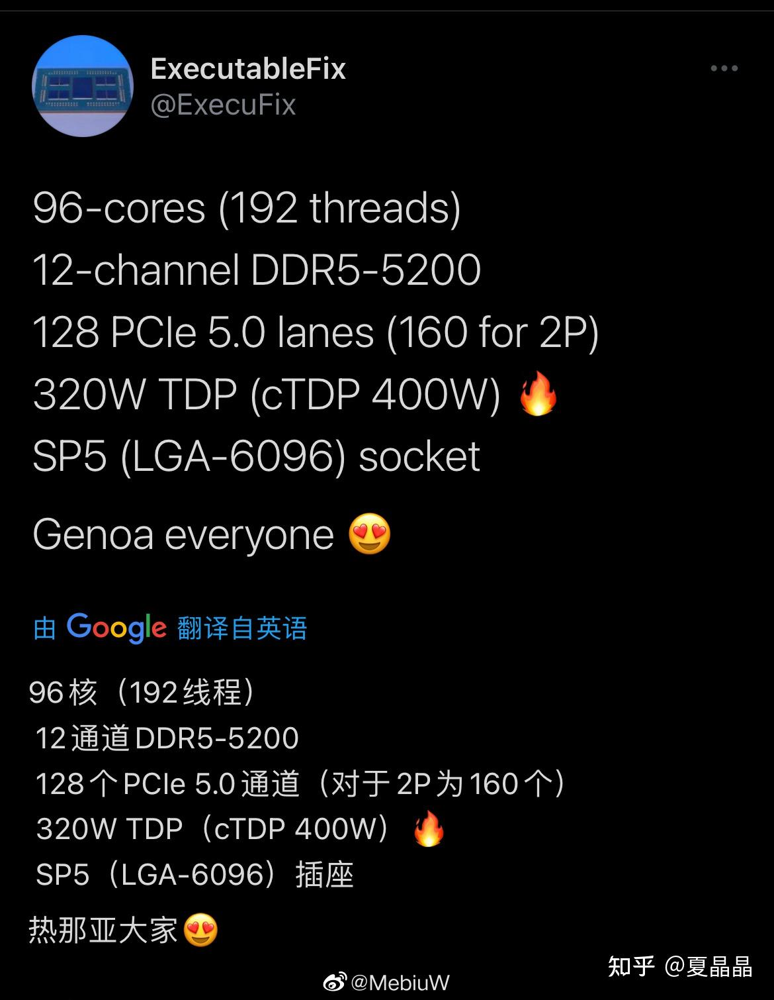
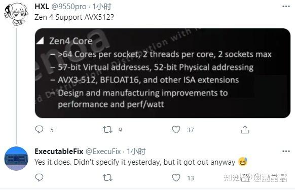
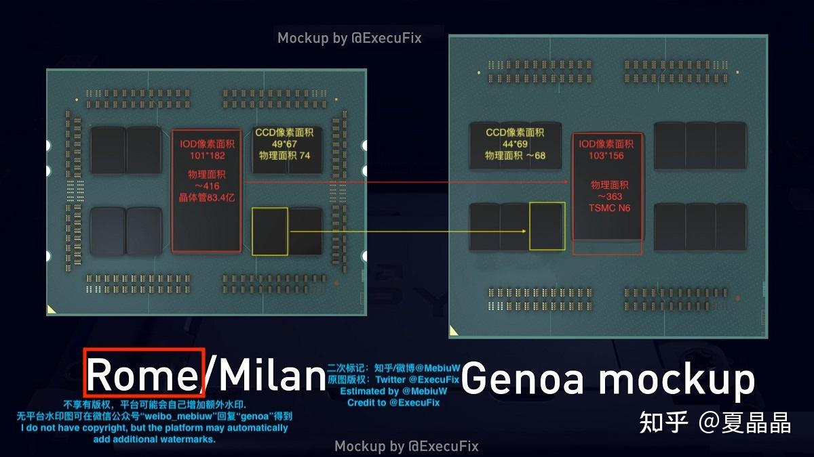
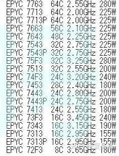
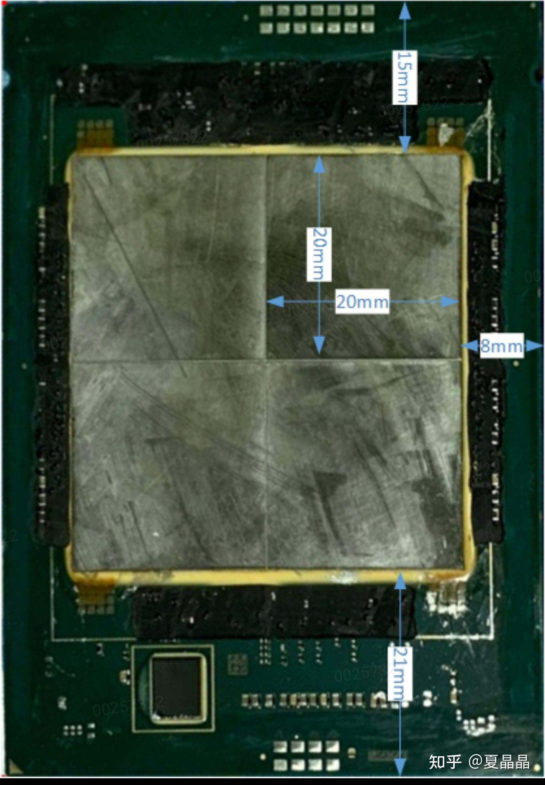

# 也来猜一把ZEN4，MARK

> **类型**: 文章
> **作者**: Dio-晶
> **赞同**: 66
> **评论**: 14
> **时间**: 1615109204
> **原文**: [https://zhuanlan.zhihu.com/p/355218689](https://zhuanlan.zhihu.com/p/355218689)

---

送小朋友上培训班，还右脑开发，你懂的。

能怎么办，钱不可惜，但我除了在楼下再洗个脚开发一下小脑，好像也不能再干嘛。

网上近期ZEN4的rumor频发。

哈哈，对未知的好奇是人类的共性，如果还能附带装个逼，简直完美。如果到时打脸了，可以假装无事发生，如果命中了，翻出来装double逼那真赚大了。**所以今天mark一下，明年再来挖坟。**

Twitter是一切谣言的起点，俗称一号谣言制造机（即一号窑鸡），当然这两年yutube和bilibili有后起直追之势。

无论你信不信，芯片设计虽然逐渐成为了国家科技发展的重中之重。但很多人肯定没有意识到，一个优秀的芯片战略规划师、芯片市场竞分师能力的一个重要评价指标，就是看他能否从twitter、yutube等地方及时、准确地挖掘到各种rumor并给出合理的分析报告。推特治芯并不是空穴来风。

正经的，我就有一个做得非常好的朋友。

网上有效的rumor都源于下面三个图。

图3尺寸的标注源自橘猫同学，他也是我朋友重要的rumor来源，很多分析都挺厉害的。如下贴，看起来他对这个mockup的样子相当bias in。

<https://zhuanlan.zhihu.com/p/355097510>

我跳出来，当然是对这个判断持有一些意见。

首先我们看看ZEN2～ZEN3的历史，下面这个ZEN3的list非常重要，从各个其他信息源交叉的情况看可信度较高。

对比一下ZEN2看出什么了吗？ PPA的平衡并不是简简单单能够打破的，ZEN3相比ZEN2提升了IPC，但这不是免费的，在工艺不变的情况下，相同TDP（按次顶配225W算），64Core版本的基频从2.25GHz下降到了2GHz，CPU能效大约降低了10%，当然AMD据说在6nm迁移了一版ZEN3+，我猜其目的就是通过工艺要吃回这丢失的能效。

那么到ZEN4，假设是5nm，你是AMD首席架构师，你能做成什么样子?

首先有两个大原则不能碰，当然也不是绝对不能，只是需要非常大的魄力。

1、PC与server要共用CPU die，这节省的成本不是一点点。

2、PC与server的封装尺寸可以稍作增大，但一些基本约束是不能变的。

我反对rumor的mockup，很重要就是第2点，面向mass production的封装不会变这么大，特别是窄边60mm宽带，相信我，不会突破。DDR也不会是12CH DDR，单板大改在OEM、用户部署上都会出大问题，出了事要被fire的。

我能那能做什么?

1、5nm的工艺收益是100%要榨干的，但IPC一定是有面积开销的。

2、PC这两年虽然8C独领风骚，但intel这煞笔非要搞个10C来压一头，表面上虽然毫无用途，但场面上PK还是落于下风，得靠两颗CPU die组合成16C来打，但是实际上你懂的，这种chiplet结构最终表现是两个8Core，对于双子和双鱼座之外，其他十个星座的人都不会bias in。从内部看，在ZEN3已经解决了内部L3的共享问题，再扩展到12Core问题不大。

3、所以我倾向于把PPA的收益用在IPC提升和增加core数量两者，最终以～10%的单核IPC及～10%面积代价（无AVX512），再附加12core per 的die，最终在TSMC 5nm算出～80mm per die，然后还是拼接为8+1 chiplet，8 channel DDR的main stream CPU，成本OK，打intel主流市场，棒棒哒。

等等，你肯定会问，说好的AVX512呢？ 12channel DDR怎么是谣言吗？

不是。这事得再扯上intel。

icelake鸽鸽鸽鸽鸽了这么久，真正的后来者基本上是科罗拉多和的红宝石激流了。

应该是个人都知道吧，sapphire rapids为了增多强未来的技术更高地，增加了HBM版本。

其中上一篇谈做G的时候就有同学提到，HPC业务其实很大程度是memory bound，在HPC甚至AI上用GPU，更多时候是贪图HBM而不是SM，随着CPU数量的增多，多线程也能将带宽充分地发挥出来了。下一代的HPC，我觉得纯CPU（内嵌一些AMX之类加速）会更有竞争力。

我们先看看sapphire rapids的刨片图（网上的），即使四个die合封尺寸这么巨大了，intel也都把封装尺寸控制在80mm x 60mm之内（其中的技术难度是神级的）。

说这个尺寸干嘛呢，其实意思是，HPC市场和server市场不一样，做主流像个白盒一样放在数据中心，封装是不能乱搞的，即使是AMD，就当是抄作业吧，怎么样单个DIE尺寸也不能突破80mm2，以保证最终8+1后封装尺寸在80mmx60mm之内，12 channel DDR也不是能随便上的，如果有大客户谈好价格定制可以，但是封装尺寸变大那价格也是非常漂亮的。

但是HPC市场没有这些约束，怎么强大怎么来，即使是intel，如图可见，HBMB版本的sapphire rapids封装尺寸也会巨大突破现状。此时，请注意AMD的一个破绽，他家的CPU为了成本，MCM封装是没法兼容HBM的！！！ 而INTEL有EMIB！ 在食物链顶端这完全没法打，虽然AMD也是有TSMC的CoWoS能力，但这美好的价格是不能用于Server CPU的。整个革掉MCM的命? 那要是一个疏忽，崩盘都可能。

4、为了应对intel sapphire在顶端市场的压制，我是AMD的话，我会放开CPU DIE面积约束，加核，加AVX512（AVX512只有在真正的HPC下才是性能神器），因为没有HBM，我用12channel DDR来打高端，虽然MEMORY弱了点，但用核数量也能压制死intel，再加上成本绝对碾压，田忌赛马打法，能赢的。

反正ARM还没起来，AMD无论手上有什么可能性，作为架构师，其实最终目的都是要保证怎样在intel和amd两极互殴中获胜啊。

综上，ZEN4的会出两个版本：

**主力发货是12 cores per die，PC与Server共用，PC做1+1的12C，Server做8+1的96C+8CHDDR+AVX256，基础频率2.25GHZ on TDP280W。**

**顶端在做一版从上往下打，能卖多少看用户的接受程度，逐步突破HPC和部分愿意液冷定制的云服务商。做16 cores per die，仅HPC+Cloud做8+1的128C+12CHDDR+AVX512，基础频率2GHZ on TDP 400W。**

**MARK 2021-03-07**

**先把认怂的图片准备好。**

---

*由知乎爬虫生成于 2026-02-01 15:39:00*
