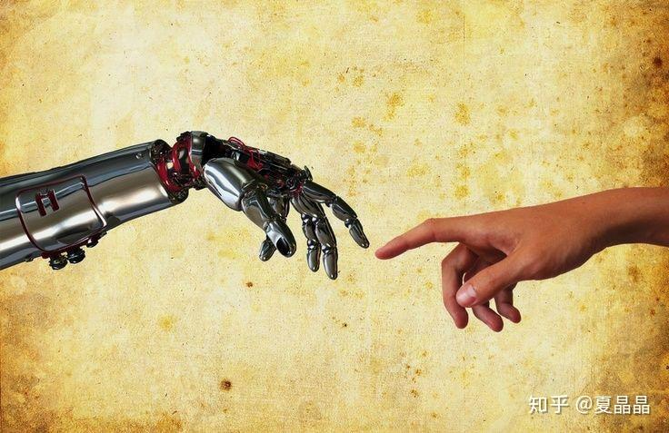

# 论人工智能如何落地

> **类型**: 文章
> **作者**: Dio-晶
> **赞同**: 270
> **评论**: 33
> **时间**: 1607415389
> **原文**: [https://zhuanlan.zhihu.com/p/332291332](https://zhuanlan.zhihu.com/p/332291332)

---

出差在途，机场没事做写点东西……

先上一张老图振奋人心，创造亚当！

AI这一轮的火热至今已好几年了，光是带动的资本和就业就不是一个小数字，我感觉是PPT写上AI，资本就能搜搜地砸，随便调过几个网络，offer就能搜搜地拿…………

# **那感觉就是：**先天领周天，盖周天之变，化吾为王。

不过，截止今天，AI真的改变了世界吗？ 可以说有，也可以说没有。至少我们得承认，并没有像几年前我们曾经预期那样……

我们认识到当今的AI实际上是一种弱人工智能，也渐渐变得喜欢退一步用修道炼仙丹来维持高冷感了。

嗯，坊间也总是不定期有一些不怀好意地冒出各种寒冬论来扰乱人心。但客观来讲，学术界顶会的投稿数量是越来越多，传统行业的一些AI应用也都能看到效果。

但港真，我们当下还是缺乏AI能够真正落地，真的能解决传统行业里面的痛点的那些企业跟项目，不仅仅解决实际问题，并且AI项目跟企业都能赚到钱的路径。

最初我们以为图像识别领域是AI的最大市场，因为最初的DL都是以image为出发点。但实际走到市场上，这个空间就是视频监控市场。但同样，因为CV领域技术本身的成熟度，AI始终只能成为锦上添花的存在。而且因为安全性的问题，这个市场最终是被政府管控的，也就是最终变成了一个关系市场……你妹，所谓旷X、云X、商X之类，最终都变成了在某一个我们曾经讨厌的政府关系户类科技公司了。

我们也曾经认为自动驾驶是AI的未来，比较涉及到用一个千万级高价值市场，但是其中涉及到几个认知和决策的根本性问题没有被高层次地解决（这也是我这个帖子想说的内容），导致短期看不到传说中马车纷纷转换成机械车的事情再现。嗯，地XX从监控转到自动驾驶，我也不知道想干啥……

最终目前主要挣钱的点是搜索和推荐系统，典型来说，就是当今大型OTT，你看到的淘宝、今日头条给你最想要的都是推荐系统的作用，为OTT们带来了巨大的利润。但是坦白地说，这个商用落地是意料之外的，是基于个人信息和商业信息被大规模集中和标记售卖获得的，即大数据时代初期的资产规模流失的结果，这种钱赚的如此的容易，以至于大量OTT公司已经从技术公司转身成为了金融公司。

上面所有的模式不够健康，我认为真的不能长期持续……

我希望看到AI落地是真正提升生产力，解决以前不能解决的问题。

问题1：**人类科技发展最大的方法是什么?**

是：**解耦**

人类科技的初始，肯定是依赖于某一个天才对一个问题的分析和解答。但随着科技的发展，问题的复杂度逐步提升，此时就出现了解耦，将一个复杂问题通过各种角度的分割界定，让复杂问题变成了若干连续性和存在依赖关系的简单问题。只要相互之间的接口定义足够清晰，那么这些简单问题解答（甚至是多路径解答）之后就能组装成复杂问题的答案。就像我们手上的手机，那是解耦到及其巨大数量的子问题答案的汇聚，早就其复杂度早就超过了任何人个体的能力。

-----------------------

问题2：**当前AI或者说DL的本质是什么？**

是：**拟合**

当前DL无论怎么样美化，其本质是通过足够多的数据在低纬度空间拟合一个高纬空间。从某种角度来讲，中医其实就是一种医学的DL。这种拟合某些时候能够得到理论上的解释，但很多时候不能，特别是我们面对一个复杂问题时，往往不做解耦的话，我们的能力对问题本身都无法理解。

-----------------------

**所以，我认为目前AI（DL）难以落地，难以解放生产力的主要原因是：解耦与拟合之间的矛盾！**

为什么会有这么一个认识，出发点是我写代码拿了海思的冠军。嗯曾经这个帖子……

<https://zhuanlan.zhihu.com/p/111677883>

这次比赛过程中有人使用了chisel，并且结果还是令人比较振奋的，并不像更之前那样毫无竞争力。与此起点，我认真地思考了一个问题，就是如果用AI来探索其题目的设计空间，能否找到比我更好的电路设计? 我想其他领域也有类似的思考，AI能否替代码农写代码之类的?

经历了一系列复杂的评估和推理，我基本上得到了一个答案。

那就是：**当前的AI不能！**

原因其实很简单，当我们假想一个神经网络在广阔的设计空间无尽探索的时候，我发现AI其实在近似于死循环中做着假装探索的样子。

因为像设计大赛这样一个限定性强烈的题目下：**设计空间非常狭小，甚至于像一个牛角尖。**

答案真的是呼之欲出，作为一个比赛或者说考试，它的本质是就是将问题解耦成了一个人（单体）可以在限定时间内解答的能力范畴！ 在人的先验知识可完美覆盖的范围内，AI凭什么和人打?

## Never fight with idiots.Because they will equalize your EQ with theirs and defeat you with rich experience. 永远不要和白 痴争辩。因为他会把你的智商拉到和他同 一水平，然后用丰富的经验打败你！

上面这句话是目前AI同学面临的尴尬。

**AI的能力是在多维空间中拟合出一个低纬解，如果主动降低问题的纬度到人的个体程度会大幅降低AI的能力。**

我再举个简单的栗子！

在自动驾驶领域，以感知来讲，人们用自己的方案设计了整个CV的流程，先是camera采取图像 --> 然后用ISP处理图像，将图像纠正成人眼识别很爽的图像 --> 然后将图像打上标签给NN网络识别物体和轮廓。

看到问题了吗？ 我滴个神啊，为什么AI必须要用人眼的方式去识别图像啊? 为什么不能用camera RAW data而必须先用ISP修图呢? 如果在更进一步，为什么AI就要像人眼那么去用RGB识别有限的可见光谱? 不能有AI专用camera吗？为什么一定要用人的先验知识强加给AI呢? **这种基于人解耦后的先验知识本身就把AI的能力卡死在人的能力空间范畴了，这又怎么超越人力呢？**

为什么不直接用RAWdata训练而用ISP呢？答案其实也很简单，能气死人。因为如果不用人类的流程，人没法给image打标签给AI做训练，切无法衡量AI的准确性…………（按照人的标准的准确性）

唉 ╯﹏╰

同理，最近在稍微研究了一下EDA tool，看到的也是同样的问题。为什么数字电路设计被拆解为综合、布局布线、时钟树、时序收敛……就是因为这样分解的结果对是人为主体的能力控制范畴，和工厂流水线设计是一种策略。

……所以，我的结论是：**未来要AI落地的关键，是反解耦，反流水线，反序列化。增加一个问题的空间纬度使其超越原本问题的纬度，混水摸鱼，让问题处于人力无法解答的范畴时再用AI拟合（想想黄帝内经）。NN怎么训练呢？ 此时的人的先验知识不能简单地作为NN的输入和输出，而必须重新提炼作为中间拟合趋势来帮助NN收敛，实在不行就采用养蛊的方式自然选择嘛。**

如果以EDA为例，我认为要发挥AI的能力提升EDA性能，必须将这些流程全部打通，用一个网络直接将RTL转换成GDS（其实这事好做，因为这种空间超纬后的输入输出可评测）。

该说的都说完了，这也是我能力所限的级别所能看到的答案。我并不知道站在更深入的理解程度上是否有其他的视角。

不过再换句话说，即使能找到答案，是否AI会向着这个方向演进呢？也不一定，有可能是悲观的。这个世界是一个比烂的世界，你只要不比别人差就能赢。换句话说，当内卷的收益大于扩张的收益时，还是内卷更受欢迎，毕竟数据（信息）这种资源目前还没有被严格管理起来，君不见，资本都已经下沉到社区的肉菜市场与菜农争利了么……

**前进，前进，不择手段地前进啊！**

---

*由知乎爬虫生成于 2026-02-01 15:39:01*
