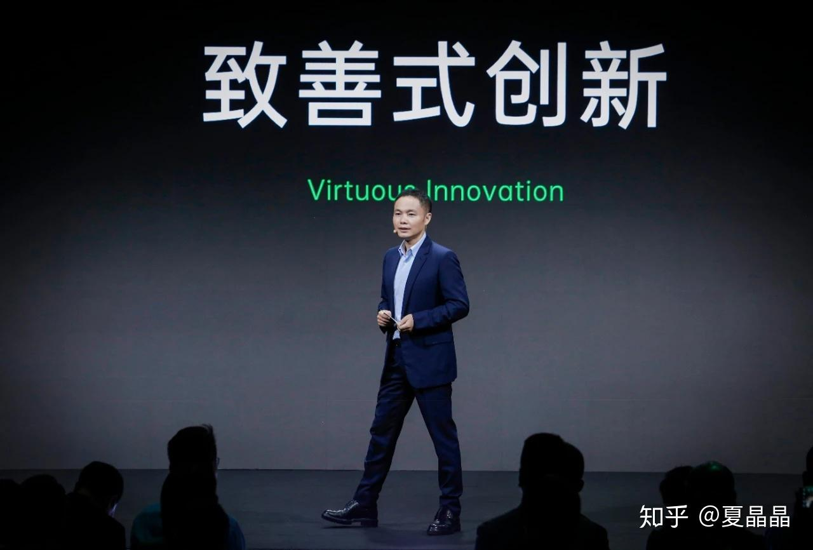

# 关于技术创新

> **类型**: 文章
> **作者**: Dio-晶
> **赞同**: 20
> **评论**: 6
> **时间**: 1606095119
> **原文**: [https://zhuanlan.zhihu.com/p/307348231](https://zhuanlan.zhihu.com/p/307348231)

---

最近听到同学们纷纷谈着创新……

“这个世界需要一些不一样的东西”、

“disruptive innovation”

嗯，没敢接话。

无他，立场带来的视角有点点差异。

如果一个市场是1000亿美元，净利润超过300亿美元，这是多么美丽的市场啊，为什么要破坏它。

我们吃着大葱卷着饼，羡慕着西方的沙滩度假晒太阳。口中说着“王侯将相宁有种乎”。但实际上，是想取而代之啊。

我想的是我也去沙滩度假晒太阳，而不是大家都只能吃大葱卷饼啊。

**优解：**同质但更强的技术，典型就是apple的M1 CPU。一个健康的市场，如果能够用完全相同的东西去无隙替代，这样对市场的健康度损伤是最小的。摩尔定律需要钱，需要很多钱，如果不能做到持续增长，就尽量不要去破坏原本的循环。

<https://zhuanlan.zhihu.com/p/104453844>

**更优解：**找到一个大家共同的某个无法逾越的困难，例如disaggregate，你有一个更好（比原方案贵一点其实很棒）的解决思路，通过贵一点但更好的生产力替代原方案。

**势优解：**市场因为新技术的诞生而产生了新的市场空间，有势能在，这个空间容得了大家你死我活地互蚀，最终重新划定范围。但看看物理领域的寂静和贸易战、新冠…………

**次优解：**唉，也不是不行吧。逼急了大家就内卷呗，。最终把整个市场拉低到500亿总份额，也许，反而变成吃独食…………

刚好看到OPPO的一张图，挺好。

---

*由知乎爬虫生成于 2026-02-01 15:39:01*
