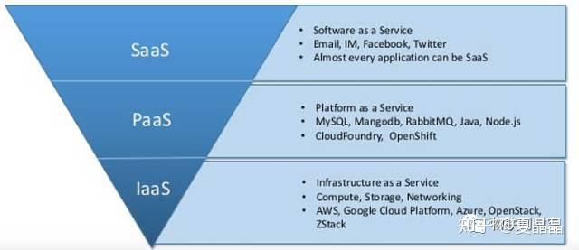

# 为什么、能不能改造数据中心网络?

> **类型**: 文章
> **作者**: Dio-晶
> **赞同**: 64
> **评论**: 20
> **时间**: 1606062655
> **原文**: [https://zhuanlan.zhihu.com/p/306583527](https://zhuanlan.zhihu.com/p/306583527)

---

嗯，遇到很多同学对这事缺乏信心，更甚者其实是对这个事情的可行性心存疑虑。

好，我只是一个平民，请让我对这事来盘一盘逻辑。

## 灵魂第一问：**你相信世界未来算力的核心是数据中心（data center）吗?**

**不是：**嗯，麻烦点击左上角箭头或从左侧左划一下屏幕。

**是：**君不见，亚马逊市盈率80，市值已经15000亿美元? 当数据逐步替代石油成为这个时代最重要的资源之后，以数据为中心的寡头，包括亚马逊、微软、阿里、腾讯，其算力的核心载体都是其巨大的私有或公有的数据中心。

## 灵魂第二问：未来数据中心的主要形态是IaaS or PaaS or SaaS or serverless?

现阶段，当我们谈到云计算时，没办法，主要是指IaaS甚至于裸金属形态，因为这是目前云盈利的最主要的空间。

无他，这种形态的云计算实质上与共享单车并无特别大的差异。IaaS将原本的分布式IT设施集中化建设和管理，即将原本个人或企业本应存在的IT资源整合提升效率，这种模式其实是让我很讨厌的，这其实是一种内卷，原本能卖3份CPU的最终只卖了2份钱，对某些贪婪的情况甚至只卖了1份。没错，个人或企业获得了成本收益，但这种创新仅仅提升了生产效率，并没有提升生产力本身，反而某种程度上是损伤了生产力。详细解释一下这个说法，其实原本需要IT基础设施的客户有3个，各需要算力为1N的CPU，客户消费为3X，但是选择了IaaS，云服务商可能就只买了一个算力为2N的CPU（复用），客户消费降低到2X，而CPU的销售可能降低到1.5X，云服务商赚了0.5X。看上去很棒，但是！IT基础设施不是石油资源，而是一种技术更迭，市场规模的缩小只会导致技术投资的减弱，进一步导致的是，这些客户原本在第三年可以以1X的消费购买2N性能的CPU的但变成了云服务商购买性能为3N的CPU，客户最终拿到的性能只有1N或者1.5N而已。摩尔定律的演讲需要大家用钱来砸啊，我的一个链接曾经有详述。所以，我不喜欢IaaS。

<https://zhuanlan.zhihu.com/p/104453844>

此外比较恶心的一点是，业界的IaaS其实利用率很低，30%～50%，这算锤子个生产效率提升啊！！ 你能把十个用户的CPU、DRAM&HDD容量集成到一个机柜，但你能集成十个不损伤用户体验的DRAM带宽和网络带宽么？

IaaS希望用户看到的是与自己私有（如果有）的IT设施是一模一样的。所以IaaS的物理形态除了相比私有IT设施更粗大之外（for多人共享），没有变化，在这个设计空间中，除了做smart NIC把原本不存在的虚拟化共享开销抹掉之外，找不到硬件进一步改进的价值动力，如果持续呆在IaaS的空间约束中，数据中心网络没必要改造，越便宜，越与用户原本的以太网一致越恰当。

那么，能跳出IaaS空间么？ 这首先涉及到的问题是用户体验，是否用户能够接受不看到IT基础设施呢？ 其实在某些特定领域是能够的，例如微软的office套件，例如云game，例如client的service。这些变化都在进行，但还不够。因为硬件上还缺乏了些引擎来提供动力，这就涉及到下一个问题：disaggregated。

## 灵魂第三问：Disaggregated data center存在吗？

这不是一个新名词，提出过很久了，还有一个别名叫data center as a computer来的。直译中文是分离的数据中心，怪怪的，合适的说法应该算资源池化。

理想很丰满，CPU、DRAM、Storage、GPU、DPU……etc解耦为独立计算资源，每种资源独立池化，不仅仅可以增强DC管理者的灵活度和掌控力，每种资源还能独立快速演进，摩尔定律演进变缓的当下，只有DSA才能充分进一步以异构方式发挥出下一阶的算力升级，算力升级的体验才能引导客户逐渐摆脱IaaS的束缚。很明显，要做DSA，池化是必须的，否则你每台CPU插一排卡? 不现实啊。这些解耦的计算资源只需要一个低延迟高带宽的网络把他们互联起来，那么逻辑就顺了，传统以太网这么个无连接不可靠的妖艳贱货怎么可能负担起这么重要的职责? 必须要改造！

事实很骨感，其实disaggregate从数据中心诞生就开始做了，最早做的是storage的池化，原因很简单，CPU访问storage的延迟是10us~1000us，带宽是1～5Gbps，这种级别的需求，拉根电力线都能做，不过即使如此，我拜访微软时依旧看到azure机柜的每个机框内补充了M.2作为hot storage补充。

存储尚且如此不干不净，其他设备能做到吗？ 其实DRAM已经接近证明是不行的了，100ns延迟级别和200Gbps带宽级别的需求，即使未来全光交换上（不考虑成本和功耗损失），业界的评测数据显示依旧是不可行，如果不用光互联，交换机延迟最低也就做个100ns，那更加也是不够的。当然我们看到IBM power已经做到了DRAM池化拉远，HP的GEN-Z（光互联based）也在做同样的事情。但我的答案依旧是不行，IBM的DRAM池化仅限于其主力场景数据库的收益，数据库业务特征是高并发但DRAM带宽低，所以powerCPU可以依赖SMT8减弱DRAM池化的延迟损伤，并通过池化后巨大的单实例DRAM空间获得减少storage swap损耗，再获得总收益。数据库是一个特例，GEN-Z如果也是走这个逻辑，搞点细分市场可以，但在通用的数据中心很难有戏，太特殊。

所以，所谓disaggregate是存在程度的差异的，即当前业界无法实现fully disaggregate，退而求其次走向异构计算资源（CPU、GPU、DPU）的partial disaggregate看上去更加靠谱一点。

先不说网络，partial的问题是数据上下文。假设CPU在北京，GPU在南京，DRAM不能池化的话，如果一个业务小粒度不断来回切换CPU和GPU算力，这数据搬来搬去……用网络还不如卡车运硬盘呢。

所以计算资源池化，需要一个强大的软件scheduler，这个调度器需要能够识别异构计算的能力，并对数据迁移与算力收益计算出合理的cost model，当然如果计算任务能够按function grantle来描述，既没有上下文（只有input/output），也内聚且颗粒度足够，会简单一些，可惜用户写软件喜欢OOP而不是FOP啊！

改造以太网建设一个高带宽、低延迟的网络固然重要，但也需要一个计算性能超过现有CPU 10\*N倍的DSA吸引力，以及一个新的编程语法或者调度器，加在一起，才能画出完整的patial disaggregate data center蓝图！ 好难。

## 灵魂第四问：当下改造数据中心网络这事能成吗？

不知道，我认为这不是一个架构师应该去考虑的问题，功利只会影响你的判断力。 我一直以来总结的架构师的三个基本素质：**乐观、坚韧、脑洞大开。**这里只想说前两者，乐观坚韧并不仅仅指神经大条耐操，而是时刻心怀对未知世界冒险的渴望和勇敢。再说了，三代出贵族，当下离报业守成还差的远吧，还不如把自己想象成barbarian，拿上长矛，脱掉上衣、跨上维京长船…………

因为掠夺远比胜负来的重要！！

即使失败，也当用鲜血为后继者画出正确的导航图！方不负Valkyrie之名！

---

*由知乎爬虫生成于 2026-02-01 15:39:01*
