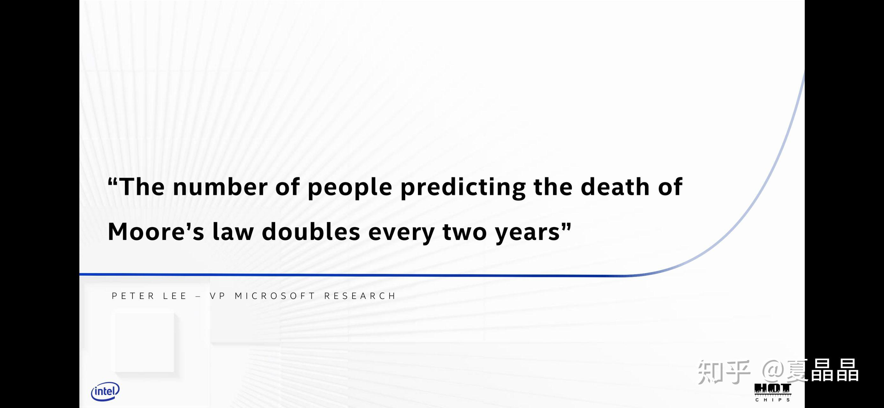
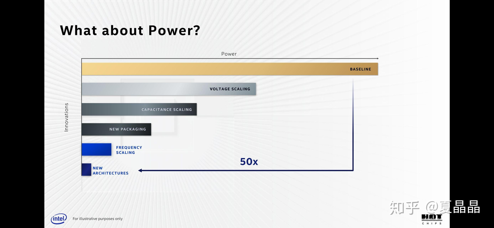
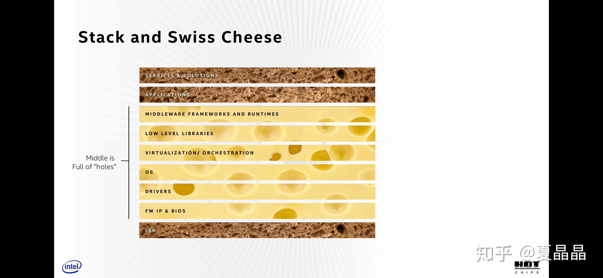
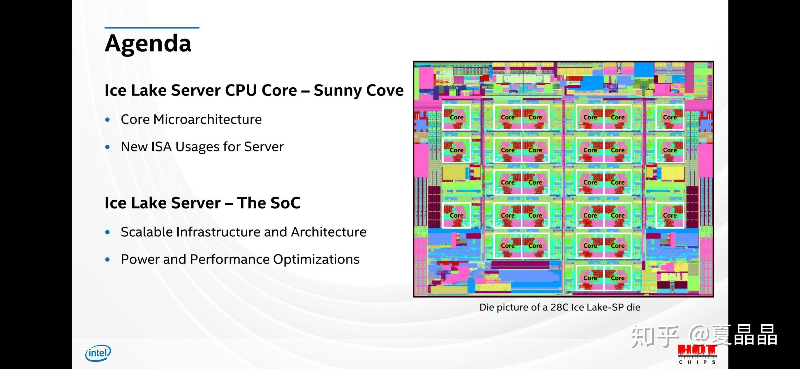
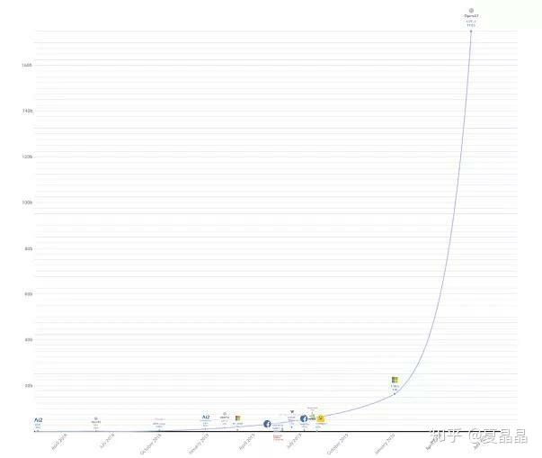
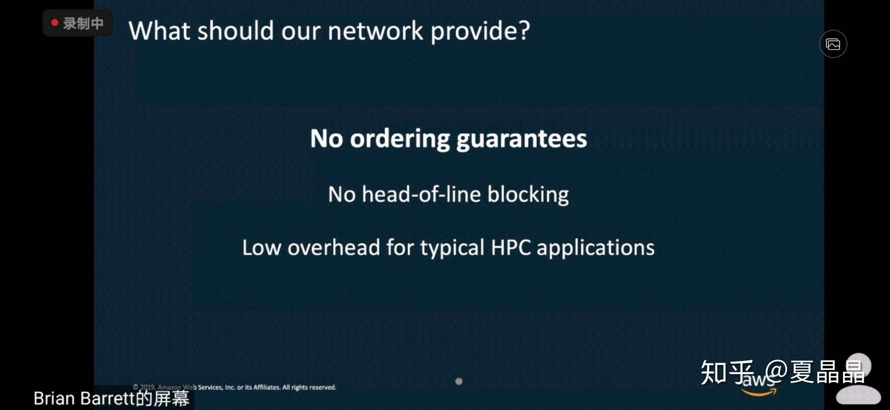

# 骚骚解读一下hotchip2020

> **类型**: 文章
> **作者**: Dio-晶
> **赞同**: 120
> **评论**: 9
> **时间**: 1598783823
> **原文**: [https://zhuanlan.zhihu.com/p/206479284](https://zhuanlan.zhihu.com/p/206479284)

---

最近也是没空上知乎，过去一周的晚上都耗在用各种姿势死磕王者荣耀了，卡在十星的附近上上下下摩擦。嗯，得认真反思一下，“努努力也能上荣耀王者吧”的错觉是怎么来的？ 虽然为了上星把华为手机都换成黑鲨3了，但…………队友好像没换啊

嗯，回到正题。ヽ(○^㉨^)ﾉ♪ 今年做了一下公司内部计算机体系结构技术大会的主持人，对一个技术大会的论文的视角有了一些新的变化。

看一个包罗广泛的技术大会，核心是要先看keynote，虽然说赞助商爸爸有权有势，但宗旨上keynote是要一定迎合会议的主潮流的，这事会下要做不少工作。所以，keynote的内容很重要，与此相应，topic也能划分轻重缓急了。

题外话，hotchip其实是绑着hotinterconnect，两个会的，前者参会看直播是需要付费的，后者则是免费。所以我周围的同学都是前者看录像，后者看直播的多。

\_(:з」∠)\_

hotc+hoti，两个会议一共4个keynote。

第一个是intel的raja的no transisitor left behind，虽然说intel是金主，但这篇文章非常值得深思。据说原文是jim keller写的，因为离职换成了raja。但为啥配色变成了raja喜欢的屎金色？Jim不是这个调调啊。最近nvidia和intel都喜欢配印度味的屎金色，前者直接上硬件，后者是充斥在胶片。嗯，所以我更倾向胶片raja参与多一些，其中最重要的提炼归纳也与RAJA更相关。

[https://www.youtube.com/watch?v=vY61ExKhnfA](http://link.zhihu.com/?target=https%3A//www.youtube.com/watch%3Fv%3DvY61ExKhnfA)

楼上是Nvidia在数据中心的视觉效果…………

4个keynotes依次展开，脉络就非常清楚了。

raja代表了传统的计算机体系结构延长线，在他看来，整个体系结构远未到终结，还有相当大的发展空间。

他首先引用了某个新的摩尔定律，就是：摩尔定律终结的人的数量，每两年翻一倍。非常应景。

其次关于工艺的部分，应该是intel工艺团队输出的内容，哈哈(ಡωಡ)hiahiahia。

具体五十倍的组成，前几页有详述，逻辑上讲是没问题的。但为啥吐槽这个是工艺团队show存在感呢？因为这50倍受到了其他很多约束而很难用，典型的就是散热问题，这直接导致这五十倍并不能直接转换为线性的收益，对应的逻辑并不自洽。

intwl的工艺团队应该是有大问题，近期twitter上有一个intel工程师对内部的吐槽连载，可见端倪。

讲了很多废话，raja真正有价值的是下面这一页，真正的直达灵魂深处。

太多分层和抽象了。

更多的抽象，会吸引更多的开发者。图上每向上一层，开发者数量都是10x数增加。但抽象带来信息不对称的损耗，形成裂缝和空洞。

如果想把空洞填满，抽象就会变得更加规则和繁琐。这减少应用的可变性，缺乏服务空间的广泛性，并因此减少开发者的增长。

这是一个两难的选择，raja的做法oneapi，我们其实很能理解他想做啥，他希望在两难的空间中选择一个更好的平衡策略。其实是很棒的。

顺带着raja的kenote延伸到具体的演讲，值得一谈的就是IBM POWER10和intel的icelake。

其实当我们看IBM的P10的时候，总觉得一种，哦，但也不出意外的感觉，很宏观的，但又抓不住锚点。但是，但是，但是，你需要对比着intel的材料来看，很多同学看intel的材料都特别兴奋，因为里面有更多细节和可落地的可能性。

其实，要跳出来看就看到了。IBM是默默地把很多业界还在吹牛逼的做法直接做成了芯片，包括DDR的serdes串行化、memory pool的拉远共享、全芯片接近300lane serdes接口的物理实现，等等，在论文都能是能看到的，但IBM就是做出了产品，其中蕴含的技术，例如serdes拉远DDR，延迟损耗仅仅10ns，这技术难度用霸气可形容，当然，其中的功耗损失，MEMORY拉远的延迟数据没有写出来，但很值得学习参考。相反intel的态度是什么呢？大家来看看啊，我在挤牙膏啊，你看我这么挤，那么挤，这挤的姿势态度是不是特别认真特别优秀啊？

我就黑intel一个点吧，也是与twitter的信息一个映照。下图是icelake的floorplan，有人问我图中芯片边缘大块的粉红色和蓝色是什么东西？ 嘿嘿，如果有人认真看过twitter上skylake高清刨片图（链接见[https://www.flickr.com/photos/130561288@N04/50129523578/](http://link.zhihu.com/?target=https%3A//www.flickr.com/photos/130561288%40N04/50129523578/)），就会知道。是空白！真的，一个晶体管都没有的空白区！ 部门墙都到这个程度了啊，模块化harden对不齐的空隙，宁可留白啊！

从raja的标准体系结构keynote到IBM和intel，其他相对就过掉吧。

---

第二个keynote是来自deepmind，讲得蛮玄幻的。但是我们只需要理解一个核心观点就好了。

AI算法在过去七年提升了44倍计算效率，这个收益远大于摩尔定律在硬件上的收益空间。所以业界有很多声音都说在强调AI的进步在于优化算法，当然，其中很多人都是做AI算法的，哈哈(ಡωಡ)hiahiahia。强调自己的价值，理解理解。

上图我百度不到高清的，唉，无所谓。最高点是GPT3。

这个曲线表达的意思是啥呢？

就是我不是想针对谁，无论硬件、算法，在AI网络本身的尺度扩张面前，都是辣鸡。

唯一的解法是scale-up。这里为啥用UP这个词，主要还是想以此映射模型并行的需求。一个模型太大了，需要用更巨大的规模的系统来承载。

这是hotchip第二部分的核心思想。

所以hotchip第二部分有大量nvidia的篇幅，此外还有cerebras等扩张者，还有微软、百度等等人的站台。

但我不想特别深入对第二部分细节分析，因为scale-up的核心是interconnect。所以我想把这事和hoti的内容结合起来看。

hoti的两个keynote分别是mellanox和AWS，相比AI的scale-up的花样繁多，这里的互联更偏向于以ethernet为backbone。

每个做技术的都有自己的技术信仰，我很喜欢AWS给出来的下面这幅图。

这是我对网络的信仰！

为什么从AI突然跳到这里，原因是，未来的计算形态只会有一个，就是数据中心，与此对应，未来的数据中心网络（南北向）也只会有一个，就是某个极简网络。在数据中心同时部署两张网络，一张给AI scale up，一张给南北向节点互通，是非常愚蠢的事情。一个rack同时出两套接口，既不经济也引入很多复杂度。当然类似GOOGLE可能在DC的局部布置一个TPU集群是可以做的，但是任务的调度和分配并不舒服。

AI scale up网络喜欢global address、多维torus的拓扑、逐级同步及reduce能力。

DC的网络愈发倾向于RDMA类别、FAT TREE、拥塞控制。

有没有一种网络能归一化这两类需求呢？我认为能。

极简网络也谈了很多年，但我理想的真正的某种极简网络，一种unified的bus，应当是截图中AWS描述的那样。去掉E2E的可靠性，选择逐级P2P可靠性保证，去除orderring机制，乱序多路径传输，E2E自行保证orderring。通过retry once类机制保证绝无头阻塞。用有限数量的FLIT格式替代边长的ethernet packet。

hotc和hoti的nvidia、mellanox、AWS都还没能做到呢，继续前进吧。

---

*由知乎爬虫生成于 2026-02-01 15:39:01*
