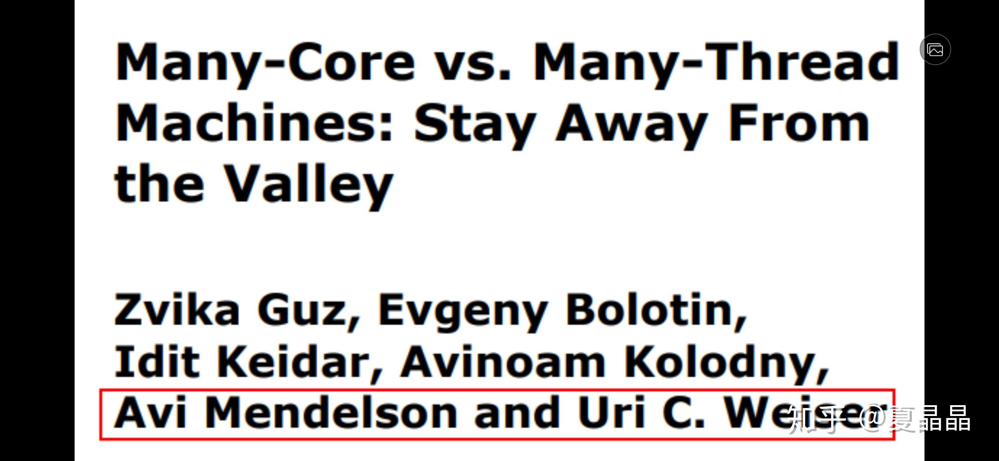
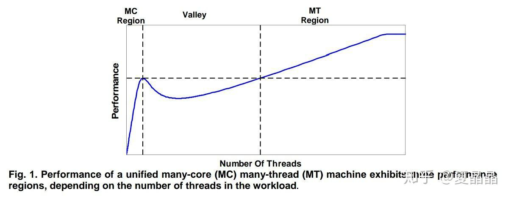

# 关于SMT的性能收益

> **类型**: 文章
> **作者**: Dio-晶
> **赞同**: 107
> **评论**: 4
> **时间**: 1595851762
> **原文**: [https://zhuanlan.zhihu.com/p/164603076](https://zhuanlan.zhihu.com/p/164603076)

---

我记得上次逛知乎的时候看到一篇关于SMT怎么算性能收益的帖子来的……是这篇吗？ 找不到了。

[CPU的超线程技术提升IPC吗?](https://www.zhihu.com/question/404826890)

突然回想起来一件事，要理解SMT的性能，就必须理解下面这篇经典论文。

[https://webee.technion.ac.il/Sites/People/kolodny/ftp/Zvika%20Guz%20Tech%20report%20McMt%20719.pdf](http://link.zhihu.com/?target=https%3A//webee.technion.ac.il/Sites/People/kolodny/ftp/Zvika%2520Guz%2520Tech%2520report%2520McMt%2520719.pdf)

SMT是否有性能收益，源于系统整体的平衡度及最终形成的凹型曲线。

现代CPU通常是super-scaler结构，要保证流水线连续运行依赖于load latency小于OOO指令窗口。当CPU数量比较少，或者内存访问量少（或CACHE命中高）时，load latency会体现为物理的固定路径时延，但当CPU数量较多或CACHE MISS严重时，即使MEMORY带宽还未饱和，load latency也会体现为统计平均上的排队延迟。前者大致是80ns级别，而后者会达到200ns及以上。

所以，如果业务运行时的表现倾向于后者，SMT能够让更多lantency bound的application把CPU内部的资源发挥出来。SMT一定是会降低单线程能力的，所以只有在单个业务能分解为大于OOO粒度（小于OOO粒度还不如就给OOO分解）的N个任务时，才能通过更好的资源复用SMT-N。

但是否SMT越多越好呢，不是。因为大多数业务在200ns延迟空间内还是存在一定的OOO能力的，SMT2基本上能在大多数应用上提升CPU资源利用率，如果业务是memory bound 例如SPECINT2006的libquantum，SMT并不能获得更好的带宽（可能prefetch有点点），也是无法提升性能的。  
SMT最友好的是graph计算或者数据库查询类application，这类业务是latency bound而不是memory bound，并且dependency严重，在OOO内部无法展开，此时SMT-N越高性能越好，典型的就是IBM的power和oracle的sparc，为了数据库性能SMT8也是棒棒哒。

---

*由知乎爬虫生成于 2026-02-01 15:39:01*
