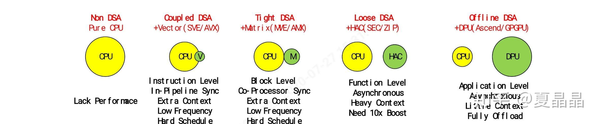

# 为被linus骂的X86 AVX512说两句

> **类型**: 文章
> **作者**: Dio-晶
> **赞同**: 200
> **评论**: 38
> **时间**: 1595848131
> **原文**: [https://zhuanlan.zhihu.com/p/164591516](https://zhuanlan.zhihu.com/p/164591516)

---

最近沉迷于公司内部的王者荣耀联赛，好久没有上知乎了…… 上周轮次的对阵，6K经济领先被对面养猪流一波莽死……伤心，戒一下网瘾，上来写几个帖子吧。

下面这个贴其实是很有趣的一件事。哈哈，很好奇，如果谁把intel马上要推出的AMX ISA再讲给Linus听，他还会说点什么(ﾟoﾟ; ？

[如何看待Linus Torvalds对AVX512的评价？](https://www.zhihu.com/question/406517759)

如下链接，在intel官网上已经有了AMX的ISA定义，是在AVX512之外再新增的matrix计算指令，针对AI为主，单纯看ISA的介绍是一个systolic结构。

最多再过一代也就推出来了，期待Linus评价。

[The x86 Advanced Matrix Extension (AMX) Brings Matrix Operations; To Debut with Sapphire Rapids](http://link.zhihu.com/?target=https%3A//fuse.wikichip.org/news/3600/the-x86-advanced-matrix-extension-amx-brings-matrix-operations-to-debut-with-sapphire-rapids/)

对于AVX或ARM的SVE，像Linus的评论，从相当多软件架构师交流中我都听到类似的表达。聊得多了我也逐渐理解了软件视角的逻辑，喜欢大一统嘛，都不想要碎片化嘛，说得好像硬件就不想统一一样。嗨，但我还是想从处理器硬件的角度把整个逻辑说一遍。

万事万物，存在即合理，如果不合理，那么自然有优胜劣汰发挥作用去淘汰，其实AVX512也已经是在一个足够强烈的竞争中杀出来的。

关于AVX512和AVX2和ARM的SVE在ISA级别的优劣，有时间可以专门写一写，很有意思。

------------------分隔符--------------

patterson其实很早就说过，在处理器体系结构里，only performance path left is DSA。不要把这个和risc-v及chisel关联在一起，这只是patterson夹带的私货。DSA的变化已经在不同深浅的各个纬度已经开始了其发展。 也务必不要把DSA简单看做某种加速卡、FPGA、GPGPU，这只是某种一种容易识别的形态。

是的，AVX其实是一种DSA，只是他是和CPU紧耦合的形态，couple的。ARM的SVE也是。

随着摩尔定律的停滞，以及功耗密度持续恶化，在LINUS想要的传统CPU架构上持续增加性能或者核数量的难度都太巨大了，所以体系结构的硬件架构师不得不把视角放到分割application domain上，希望采用逐个击破的方式提升性能。当然你可以说我的业务用不上AVX啊，浪费面积，是的，对于非AVX domain的AVX是浪费，但是这部分不用的逻辑恰好形成了dark silicon，为周边CORE运行更高频率提供了散热空间，如果去掉AVX简单堆同构的CPU NUM，先进工艺下局部热量密度会爆炸。所以，未来会越来越多Domain special的部件出现在CPU周边，不同domain调用不同部件，热量分散。intl将要到来的AMX也是同理，运行AI业务时AMX疯狂运转，此时AVX部件反而就成为散热用的dark silicon了。当然，增加CACHE容量（面积）也有类似效果，这是取舍问题。

这种集成到CPU的DSA，与linus喜欢的在外部的DPU、FPGA、GPGPU有什么区别呢？ 为啥他会喜欢后者？我曾经也是百思不得其解。后来慢慢明白了。我先用一张图说明DSA的不同层级。

X86的AVX与ARM的SVE是最couple的，直接运行在pipeline内部，可以在Instruction级别调用，但是它确实不是软件无感知的，AVX扩大了原有的regfile和state，导致了一旦使用，上下文需要倍数扩展，此外还可能造成频率下降。

X86的AMX与ARM的MVE是tight的，第二级，操作上更像coprocessor，没了解过的可以试试APPLE的AMX，一样的。这种DSA就需要instruction block级别调用了，为了防止巨大的上下文开销，某些运行过程不能被打断。

X86的QAT或一些FPGA的算法加速是第三级，loose的，很早就有，这种调用基本上是function级别，需要CPU与ACC之间采用一种produce-consumer行为进行task交互，通常因为function粒度较大，CPU是异步调用的，此时的上下文开销就非常巨大了，基本上是ms级别损耗，如果没有10x以上收益（例如RSA），很难用。要问为啥不把粒度做小一点做同步调用？ 哈哈，因为调度开销是一个固定损耗。简单说，AES加解密，如果数据长度小于1KB，ACC做得再好，都还不如CPU直接算。这个级别，目前是最尴尬的DSA，不上不下。蓝瘦。

GPGPU或者类似我司或寒武纪的AI DPU是第四级，为什么这个级别这么火，最大的原因是计算密度高但计算流程复杂度低。整个计算过程，可以全部卸载掉给DPU，而CPU做个甩手掌柜，把链路管理好，一张图丢给DPU，等最后结果出来即可。 这条路甚美。不过这条路真正能走的，也就AI和少量HPC，传统计算例如玩个王者荣耀，变数太大走不了。

如上，从体系结构硬件的角度来看，尽可能把DSA朝第一级和第四级靠，是开销最小，性能损耗最低的。

为什么linus不喜欢？ 我其实很理解，因为越小粒度的schedule，软件复杂度越高，他当然喜欢的第三、第四级别调用，颗粒大，简单嘛。当然，schedule这玩意儿的墙也太高太厚了，OS kernel在schedule及malloc这部分，几十年没变了，intel的X3D走得不好，也是在这上面栽跟头。但是第一级的DSA更加能够在CPU的DEVICE级别体现出general purpose啊，做CPU的，就是想让用户一次性投资，尽可能好和快速地满足用户的各种应用，不一定最佳，但能接受。要逼迫用户再买个GPU，是，软件没有分裂，没有碎片化，但硬件分裂了，碎片化了啊。

但无论linus喜欢不喜欢，OS kernel愿不愿意改，软件的同学如何反对，在硬件的视角已经不care了

\_§:з)))」∠)\_

CPU硬件还会持续在DSA从第一级到第四级持续加强。CPU内部也会集成更多的domain special unit，因为这不仅仅提升domain的性能，还能解决及其困难的功耗密度问题。

---

*由知乎爬虫生成于 2026-02-01 15:39:01*
