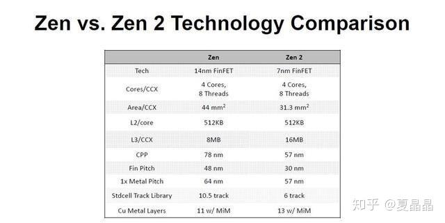
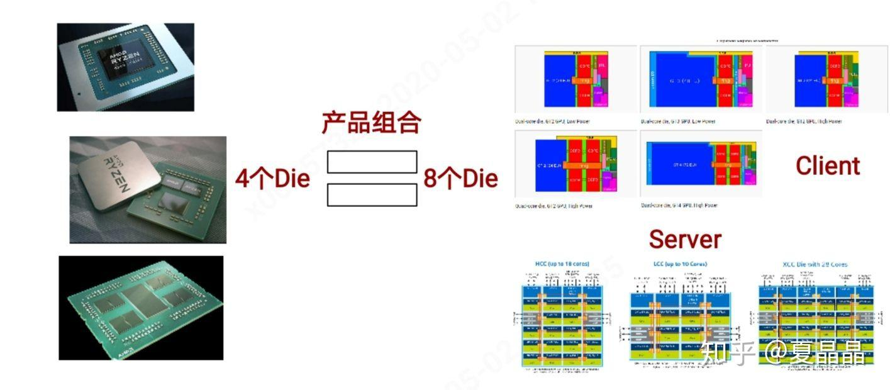
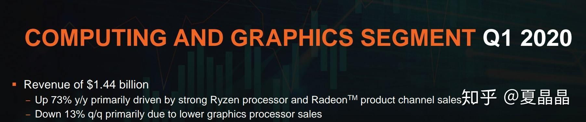
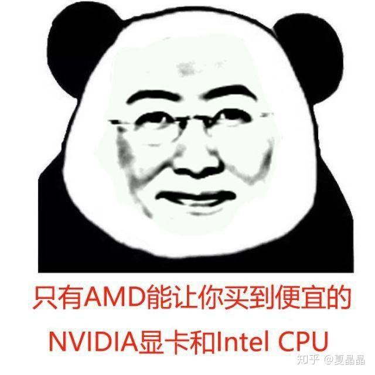

# 关于AMD ZEN2的CPU的一个秘密

> **类型**: 文章
> **作者**: Dio-晶
> **赞同**: 208
> **评论**: 24
> **时间**: 1588416956
> **原文**: [https://zhuanlan.zhihu.com/p/137799694](https://zhuanlan.zhihu.com/p/137799694)

---

AMD在ISSCC 2020上分享的信息中披露了一个巨大信息，如下所述。

ZEN2 CPU CORE使用了 6 track的std cell。

可能很多人并不知道6track是什么意思，也不想了解。直接跳到最后结论部分呼唤AMD YES就好。

——————————————————

TSMC在7nm有两种standard cell(标准单元)，这两种方案的cell高度分别是240nm和300nm，也称为高密度的6 track和高性能的7.5track。（track是指走线轨道，信号线通常必须走在track上，standard cell高度可以用多少个track来表示，6 track的意思就是在cell高度范围内能走6条线)。

从字面意思来看，器件越大，驱动力越强，信号变化速度也越快，即性能越好，典型的面积与性能的互换选择。而直接一看AMD在强调性能的CPU领域选择了高密度而不是高性能的库实现CPU，所以AMD对性能的追求不是排在首位！

打开TSMC 7nm的主要产品来看看（公开信息）

APPLE大核和AMD均采用了6 track

高通大核和海思大核均采用了7.5 track

为什么？

很长一段时间我都百思不得其解。

经过一些数据仿真，我觉得我基本上理清楚了逻辑。

1、6 track相比7.5 track，在库的特性来讲是有10～15%面积收益的，折算下来这是成本收益。

2、在标准或略提的电压0.81～0.9V区间，6 track比7.5 track性能差，频率至少损失15%。

3、在高性能处理器领域，几乎等值的性能面积收益，理智的选择应该是频率，这是该事情奇怪的源头。

4、6 track的频率电压曲线比7.5T更加陡峭，在低压下，频率的损失比同比电压更大，但是高压下频率收益也越高，到一定电压出现跨越，**在同电压下频率超越了7.5T。**

**——————————————————**

然后再看看下面这张图

AMD还做到了一件非常奇怪的事情，他用一个CPU CORE兼容了desktop+server，而laptop是独立的。反观intel，server CPU是独立的，而desktop与laptop存在兼容性。

讲道理，这个问题我答过，desktop和server的CPU很难做一个版本。intel一直就是做两个版本，但最有乳摸说要归一。但以我有限的能力来看，其中还是有很多复杂特性，鱼与熊掌不可兼得。

————————————

再加上一张图，源自2020Q1的AMD财报。主要的收入是desktop，即AMD主战场不在server。

—————————————

综合上面一系列数据与推导后，我基本上得到了结论。

1、6T的上下限更高，选择在兼容更大范围的多种形态时能效突出，简单一个比喻，在表达上，7.5T是浑厚的中音，而6T有独特的低音和高音。AMD在desktop选择了上限，在server选择其下限。而APPLE是因为只有一个大核，没有高通或华为的大核/中核，也需要用一个核模拟两个形态，大核用其上限，中核用其下限。

2、6T对成本的收益是明显的，AMD的市场核心是desktop而不是server，成本优先也是对的，apple更不用说。

——————————

最后说一下为什么AMD Yes

主要是针对server市场。其实AMD和intel更多的是受限于TDP而导致性能不能发挥，而不是CPU性能本身不足（说白了是能效）。但AMD明显相比intel具有更大的性能被压制空间，AMD选择了desktop的6T CPU的SS corner芯片给server使用，直白的说就是明明是一颗3GHZ基频的CPU，缺在量产分类时选择了工艺上偏慢、体质弱小的CPU运行在2.2GHZ基频来适配server市场。

我不明白AMD对Server市场的看重程度，其实，如果AMD愿意，他可以为server市场专做一颗die，用7.5T，性能在同TDP下可以提升10%以上

可怕，可怕。(๑ó﹏ò๑)

高通用7.5T做大核（性能优先），用6T做中核（能效优先）其实就是一个四平八稳的选择。如果apple愿意，也可以设计两颗CPU微架构，或者分别用好7.5T与6T分别做一个大核和一个中核。但很明显apple没有这么做，或者是apple的CPU能效曲线画出来没有这么大收益，或者其他原因。

---

*由知乎爬虫生成于 2026-02-01 15:39:01*
