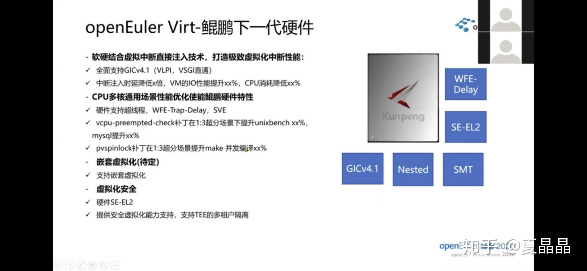

# 下一代处理器的信息

> **类型**: 文章
> **作者**: Dio-晶
> **赞同**: 67
> **评论**: 16
> **时间**: 1587485744
> **原文**: [https://zhuanlan.zhihu.com/p/134178846](https://zhuanlan.zhihu.com/p/134178846)

---

做处理器和普通芯片，甚至与火热得不行的AI芯片相比，都存在一个巨大的不同。

就是：软件生态的营造。

处理器不可能等到量产上市了，才开始匹配编译器、OS、driver、LIB这些东西，都得提前相当一个阶段开始准备。

有经验的架构师都会定期到软件的社区翻一翻，看看最近有些什么最新的model、parameter、driver在上传，都能获得一些有趣的信息，例如下面这个，就不是我泄密了。

不过，真正厉害的话，应该是从ISA、protocol的提案和布局，research的布局等，分析目标厂商的CPU的路标规划，这部分能力，还有待进一步提升，努力！！！

---

*由知乎爬虫生成于 2026-02-01 15:39:01*
