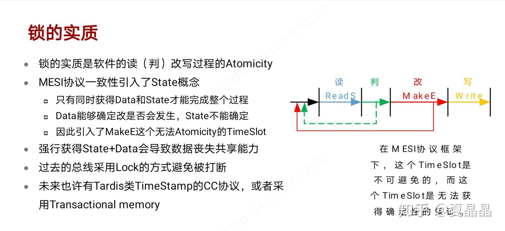
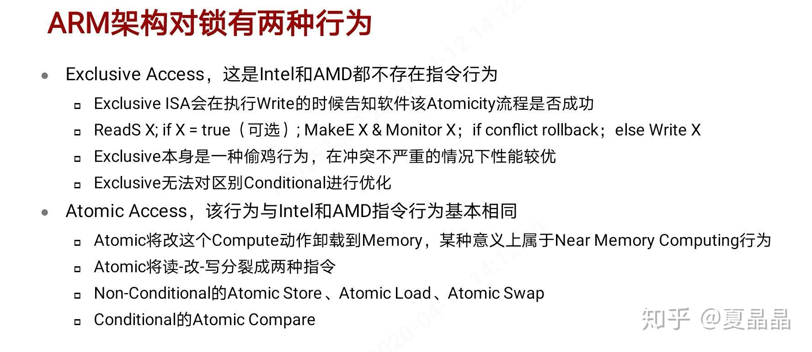
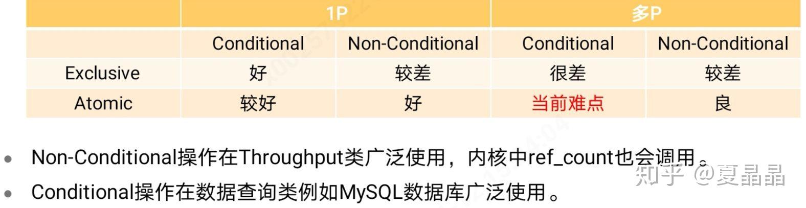
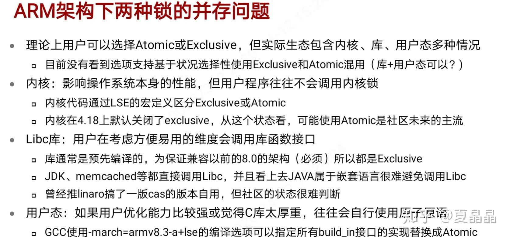
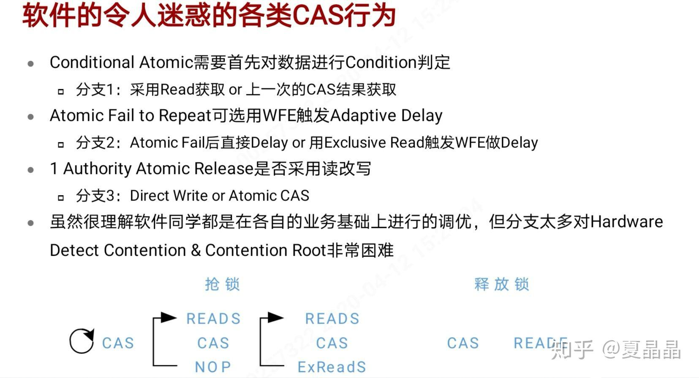
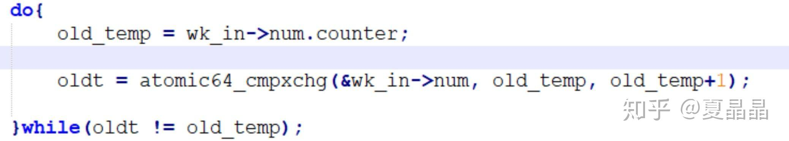

# 关于ARM架构的锁的性能

> **类型**: 文章
> **作者**: Dio-晶
> **赞同**: 288
> **评论**: 29
> **时间**: 1586678070
> **原文**: [https://zhuanlan.zhihu.com/p/129276779](https://zhuanlan.zhihu.com/p/129276779)

---

作为技术人员最近总是到处沾花惹草，缺乏技术上的专注，很是不对的。

最近一直在忙于鲲鹏930的锁的性能调优，那就顺带分享一下关于锁的一些姿势吧。

锁这个东西在软件上应用是非常广泛的，涉及到资源共享时，很多时候都依赖于调用硬件提供的锁指令来锁定资源的占用，所以锁的性能是系统scale时的一个重要影响维度。

我下面截图的一些东西都是我写的，主要是不想再写一遍所以截图了，但内容本身都是general的姿势以及本来就希望推广的生态本身，并不涉及什么公司或芯片的秘密。

没有人比我更懂锁的硬件实现了。

锁的行为在于读改写的原子性，而是否对读数据进行条件判断则再引入了一个变化量。

然后，作为ARM处理器架构师，遇到的最大困难就是ARM架构又引入一层变量。

exclusive操作是ARM架构的一个经典杰作，它的投机机制在ARM的主战场，包括IOT、mobile等小型系统里面，有非常杰出的表现。

但可惜，ARM要做server，做更大的系统，此时exclusive每次都要把数据读取到L1 cache导致的数据频繁搬运就成为了性能的累赘。

atomic我记得是在ARMv8.2定义的，软件能够快速地用起来嘛，答案是不能。

再其次，即使在某些地方能，也让我这种直肠子的硬件人员非常蛋疼。

CAS（atomic compare）本身就的语意就包含了写-判-改-读，四重意义了，只是顺序上和原子语意不一致，为啥程序员还要读一次？ 明明atomic已经让计算发生在冲突的memory层次上了，为啥要再读到L1 cache ?

看到楼上这样的atomic抢锁代码的时候，真的，我是崩溃的。

只能自我安慰一下，美女程序员写的代码都是对的✧ (ˊωˋ\*) ✧

综上。ARM多核处理器锁的性能需要软件的生态同步调优才能优化好（还有很多硬件优化的策略就不能讲了）。

1、软件的同学需要同步解决内核、libc、用户态调用等三个维度的问题，让exclusive操作都切换到atomic。

2、规范atomic抢锁代码写法，甚至用脚本对二进制作检查替换，保证抢锁用CAS（atomic compare）指令不额外加读，释放锁用atomic store或者直接用write而不用CAS。

3、抢锁失败时用delay\_n暂缓下一次的抢锁避免抢锁风暴，类似x86的pause指令。

4、用timeout WFE替代spin N-time动作，WFE结束时转mutex。

---

*由知乎爬虫生成于 2026-02-01 15:39:01*
