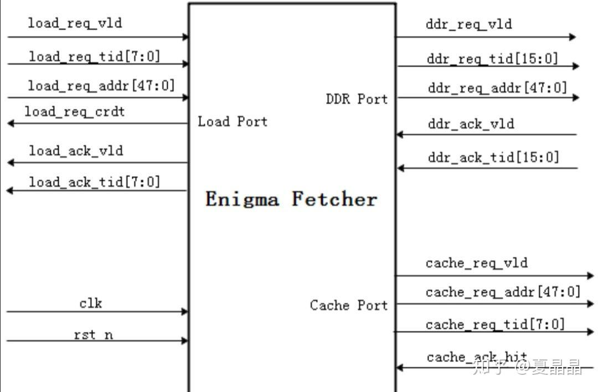
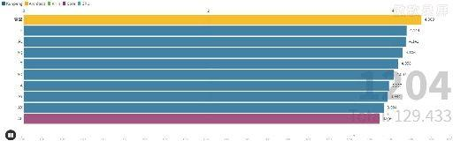
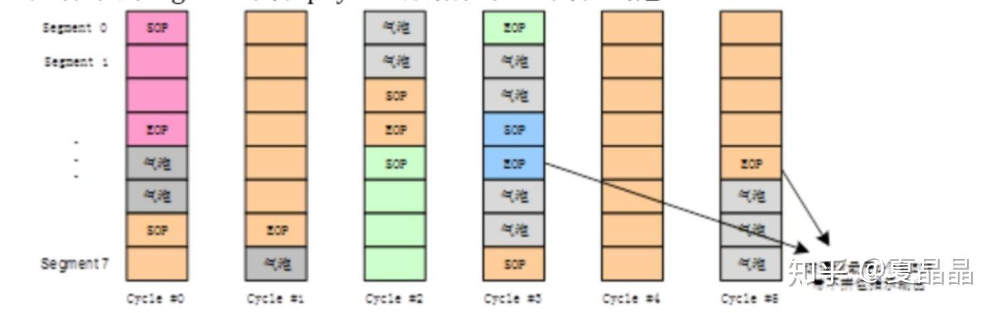
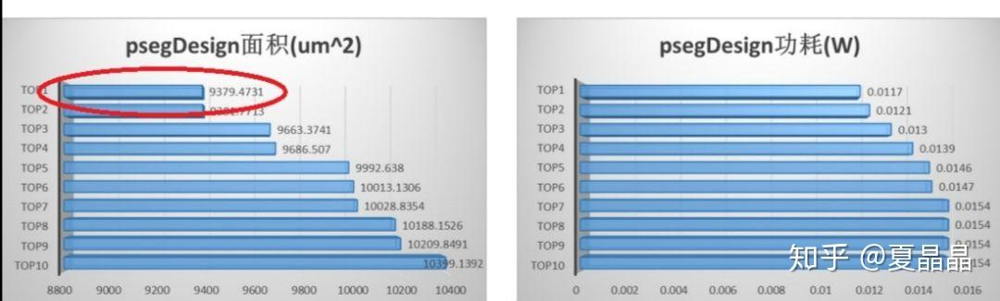

# 码农不是青春饭，我为中老年码农代言

> **类型**: 文章
> **作者**: Dio-晶
> **赞同**: 690
> **评论**: 91
> **时间**: 1583651818
> **原文**: [https://zhuanlan.zhihu.com/p/111677883](https://zhuanlan.zhihu.com/p/111677883)

---

通常中老年很难承受通宵干活的辛苦。

不幸的是，去年到今年为了赶最后截止的deadline连着搞了两次。

幸运的是，通宵第二天照常活蹦乱跳，上午是有点困，中午小睡一会儿HP就回满了。

更秀的是，两次数字电路设计大赛都稳稳拿了第一。一次可以是运气，两次是稳实力，再说，过去和未来还有不少呢。

嗯，我，四十岁的鲲鹏处理器架构师兼部分核心代码coder。在verilog语言为主的数字电路编码领域，当下放眼望去是暂无对手的存在呢。

举办编码比赛，又叫做以战促训，和军队的实战练兵是类似的。大公司平时各项目独自作战，人员独立培养，因为领域的差异，要评判一下各个队伍和个人的能力是很难的，一次公平公开又有难度的同纬度练习赛，对锻炼能力、活跃氛围、促进交流、选拔人才都非常具有价值。

刀不磨无光，兵不练则荒！  
艺不练不精，兵不练不强！

——————讲讲比赛1的故事—————

去年第一次的大赛是海思图灵业务部范围的，图灵包含kirin、kunpeng、ascend等以处理器领域，数百人参赛规模。题目其实也和CPU相关，是一个带prefetch的load unit，这个结构就是从经典CPU微架构剥出来的。入口是8B的CPU load访问，DDR访问则是64B，DDR访问过的地址会在假设无限大CACHE中命中。CPU访问共四条流，都源自specint的片段，包含random、sequence、stride、struct等类型，单流的内部存在相当比例前后访问的数据依赖。最终评定设计的Perf/Power/Area分数，7nm工艺，频率上限3GHZ。

比赛结果如下视频。

 [  PPA刷榜过程 https://www.zhihu.com/video/1219945010596360192](http://link.zhihu.com/?target=https%3A//www.zhihu.com/video/1219945010596360192) 

——————讲讲比赛2的故事——————

今年初的大赛是整个海思级别呢，参赛人数达到了数千。海思是中国最强的芯片设计公司，谁有不想证明是其中的最强呢？

两道微架构的题目，吞吐率锁定。即performance被焊死，功能正确下分别比拼area和power，也就是有四项排名。其中一个题目是乘法运算，其实看到题目的时候就知道了，考察的是从数学理解运算，把乘法用查表方式实现（题目故意放两个乘法器IP钓鱼，所有直接调用该IP完成设计的，基本上就是可替换码农级别了）。我不喜欢玩matlab和画表，所以选择了另一道更复杂有趣的。

题目很简单。输入是8个通道的大量package随机以8 segment组合方式输入，每个seg数据位宽128bits，每个package以sop开始，以eop截止，不同package相互不会间差，此外有任意位置和数量的bubble。

而输出要求是按照通道保序，每次输出单一个通道的完整8个segment。

这个题目考的是在保序基础上，对不同通道数据缓冲重组。这个题目的微架构实际上是一个数学题，并以此解决fanout问题，能算出来的一句话就能说明（我就不直接点破了），因此解题更倾向于AREA。

成绩如下，光看TOP10的差距就巨大了：

————————分割线———————

海思是中国乃至世界最顶尖的IC设计公司了，这个成绩从某种角度来看，证明一个四十岁的码农在单一领域保持世界TOP级其实是可行的。也希望很多人知道，这个世界上并不是只有美国才有白发苍苍的编码工程师，中国也有很多走在技术第一线并保持高水平的，再过十年，我也是满头黑发的码农啊(\*￣m￣)

程序员是青春饭么？ 不是！ 也是！

但如我上面列出的两道题，如果在CPU领域没有看过几篇预取的论文连SMS也不知道，如果在后两道题只知道用乘法器做乘法或者看不出排序中的数学抽象，那样的程序员是非常容易被替代的，如果到了35岁依旧没有改变，那培养一个新人可能更有价值。

对于正确的姿势，我引用下面这个帖子作为参考。

[知乎用户：为什么科技互联网公司越来越重视数学？](https://www.zhihu.com/answer/1059438493)

真正优秀的工程师，就算是编码本身。需要懂基础数学并且愿意上手尝试，才能不断进步。当然换句话说“编码的时候要深入思考”也可以。

我在大学其实挺渣的，清华EE ～80分的学分积，懂得自然懂。但这并不能阻碍我获得还不错的逻辑、随机、统计等方面的数学感觉，而我又长时间在芯片开发最底层干杂活（嗯，我写的DC、FML、ECO脚本可能比很多IC工程师一辈子见过的都多）。对于这类复杂微架构，也许有算法能力比我强的，但会被我用十多年积累的工程经验，对7nm工艺器件的理解碾压，也许有工程能力比我强的，但会被我的算法能力碾压。

而即使是我，通过这个比赛也又发现了自身相当多的不足，对某些工程特性又有了新的理解，所以，即使再下一次比赛，我想说的依旧是：

我，四十岁的码农，在verilog数字电路领域，大杀四方，无人能敌。 我为中老年码农代言。

我其实也更像成为一种示范。如果有人在verilog电路编码，希望在技术第一线上持续努力的，可以来海思，这里在某种意义上是给码农保留了长期发展空间的，至少19级纯编码岗是存在的，年薪百万吧。

写到最后，一点点叹息。

这两年带博士带的比较多，招聘了很多优秀博士，US各名校的都有，甚至清华特奖的都聊过。boss经常说“你看这些天才少年厉害的，也就是比你少点工程能力，今年补个两年就超过你了。”

嗨，我从90nm芯片做到5nm芯片，哪有这么容易补啊。但更关键的是，很多博士同学啊，太清纯了，就像神仙姐姐一样，芯片最底层那些脏活，充满恶臭和污浊，会弄脏他们不食人间烟火的手的。。。。。。

---

*由知乎爬虫生成于 2026-02-01 15:39:01*
