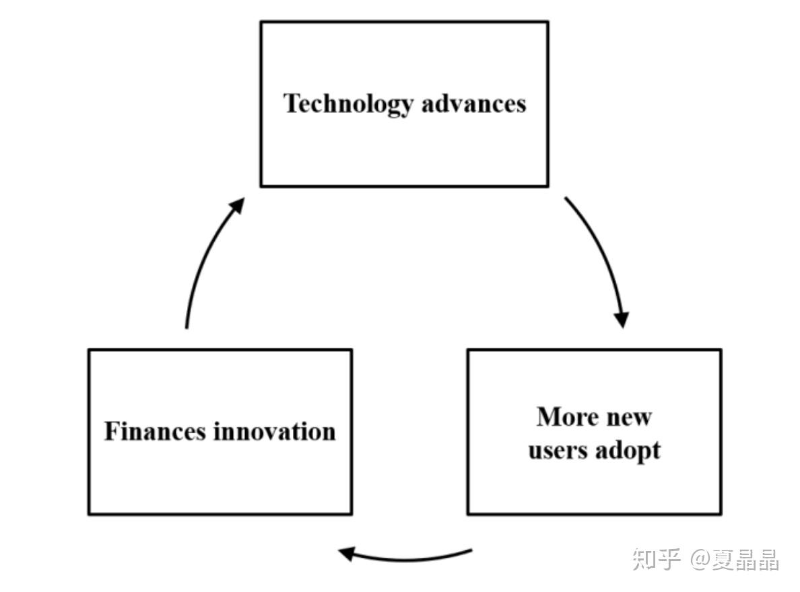
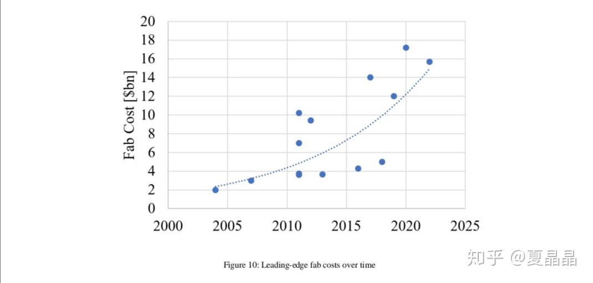
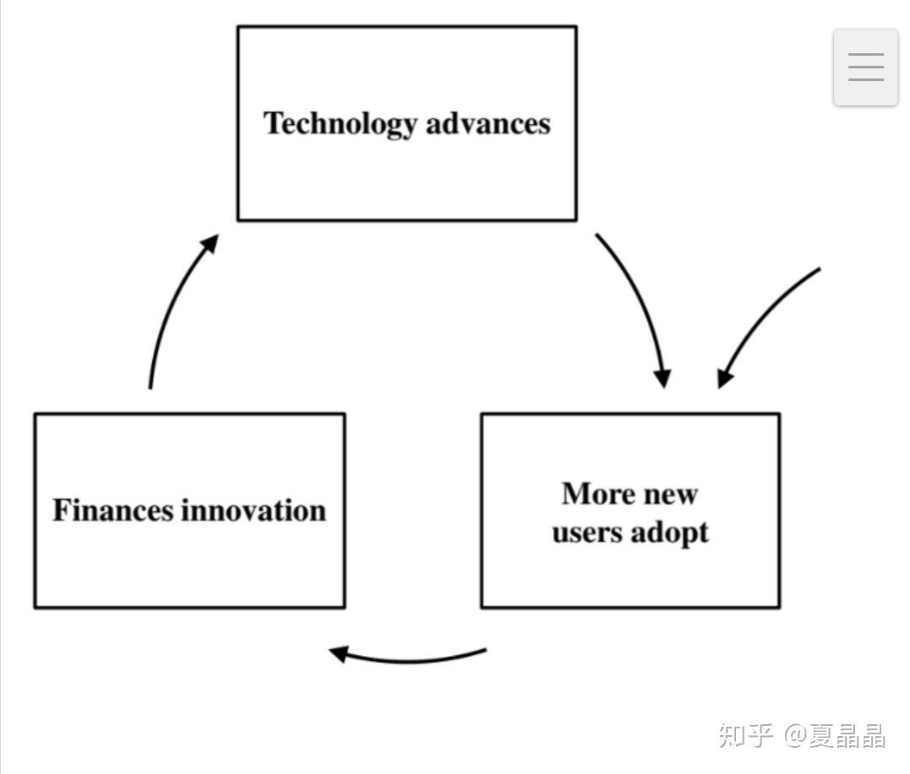
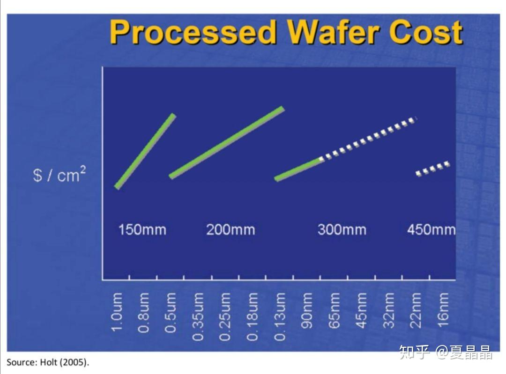
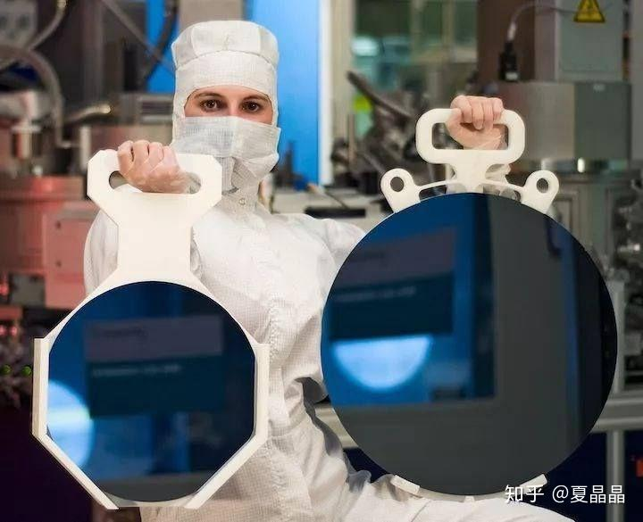
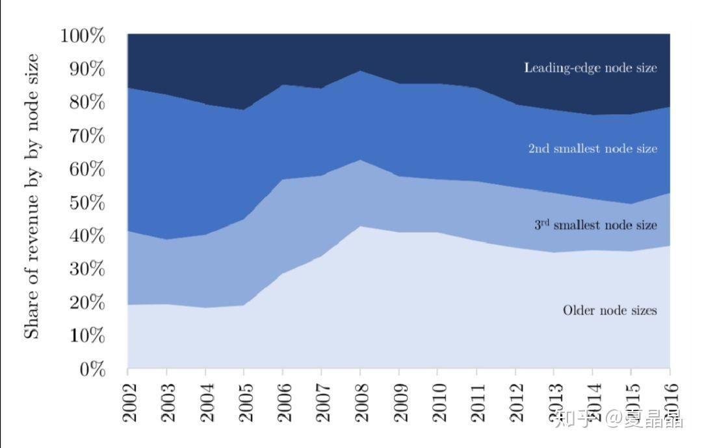
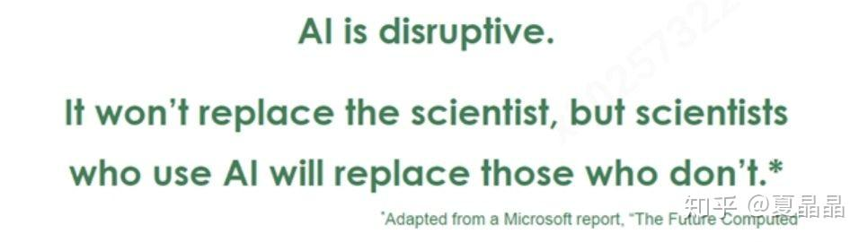

# 再刷新摩尔定律的认知

> **类型**: 文章
> **作者**: Dio-晶
> **赞同**: 200
> **评论**: 23
> **时间**: 1580451844
> **原文**: [https://zhuanlan.zhihu.com/p/104453844](https://zhuanlan.zhihu.com/p/104453844)

---

疫情严峻，封闭在家，把以前mark的文章打印出来再看了一下。这两篇文章（第二篇只是辅助）再一次把我对摩尔定律的认知刷新了一下，也让我对做好CPU充满了更加坚定的信念（因为这文章的论据都不错，但观点其实是错误的，作者写到最后都圆不动了）。

*The Decline of Computers as a General PurposeTechnology: Why Deep Learning and the End of Moore’s Law are Fragmenting Computing -MIT （[http://ide.mit.edu/sites/default/files/publications/SSRN-id3287769.pdf](http://link.zhihu.com/?target=http%3A//ide.mit.edu/sites/default/files/publications/SSRN-id3287769.pdf)）*

*Measuring Moore’s Law: Evidence from Price, Cost, and Quality Indexes - University of Texas at Austin （[https://www.imf.org/~/media/Files/Conferences/2017-stats-forum/session-6-kenneth-flamm.ashx](http://link.zhihu.com/?target=https%3A//www.imf.org/%7E/media/Files/Conferences/2017-stats-forum/session-6-kenneth-flamm.ashx)）*

摩尔定律并不是一个技术问题，什么物理尺寸极限啊，EUV啊，金属材质啊，其实都不是主要原因，不看看IMEC不已经把1nm以下都评估为可实现了么？这都是借口。也有很多观点把摩尔定律认为是商业策略，跟不上这个节奏的，就得死。但这是最终表现的结果而不是预期。其实摩尔定律是对一个良性经济生态（Virtuous Economic Cycle）的定义，说到最后，是钱 的循环。如下

首先需要明确一个定义，IT设施（含PC、mobile）的本质不代表生产力本身，而是提升生产效率的工具，就如同给淘金客卖铲子的行为。更好的IT设施，需要体现的是算盘记数相比结绳记数更高的效率，才能被生产力本身而选择。所谓经济生态，就是引诱用户开始购买处理器获得比处理器价格更多的生产力提升，以此获得资金进入开发让处理器在技术方面做得更高效；而更高效之后又会吸引用户更新再购买提升更多生产力，并吸引下一轮资金......如此循环往复。

看上去很美好。但是摩尔在最初就埋下了一个巨大的错误，原罪是摩尔啊(\*￣m￣)。

在摩尔时代，一个fab建设的成本还属于相对比较稳定的投资，而从2005年之后这个曲线开始大幅上扬了。

而摩尔再其原始定义是这样起始的：“当价格不变时，每18个月XXOO”。**价格不变！**

按过去15年算，构建leading edge fab的投入每年平均提升11%，如果加上工艺开发则是13%。这13个点的增量怎么来？ 所以过去15年的摩尔定律，也就是经济生态变成了下面这样。

这13%来自于新增用户而不是原本用户升级，这也是intel一直以来持续蚕食他人的缘由，摩尔定律干掉了很多人但也变成了intel自身的枷锁：**无新增，就得死**。

如果当年摩尔把价格增长13%也放入定律并形成经济生态，这事就解了？ 也许不行。因为这个速率超过了生产力（GDP）的增速。

而且13%是目前可见的一个结果，原始的摩尔定律不止这数。这不得不提到2012年（方舟那年）的一个巨大割裂，从2012年这个事情开始，摩尔定律其实就已经被破坏了，再也不存在了。

讲道理，从2012年开始，最迟2014年，要保持摩尔定律的第二原则（成本此时还能保存），即保证单位面积晶体管密度上升与对应价格下降，wafer尺寸应该扩展到450mm了，但是没有！

下图左是当前的300mm，右是450mm。

诚然，450m对整个产业链影响巨大，光是单晶硅拉柱的难度就大了很多，但归根到底还是一句话，钱 不够。

要建设一个450mm的fab预估的费用需要$10B，而在摩尔定律的约束下，扩大化到GDP增速约束下。没钱。

13%都快给不起了。intel也就是因为450mm上不了，在维持13%开销下强行为摩尔定律续命，包括：提升价格（唯一正确的选项）、减缓升级速率（牙膏）、增大工艺升级收益（作死）。从下图（中）可以看到，为了维系$ per transistor，14nm开始，10nm、7nm提升晶体管密度已经超过了正常的原斜率，结果大家都看到了。

归根到底，还是人类社会的经济体量不够大啊，单一行业油水都快榨干了。世界人口总数是75亿，也许还得增加到150亿？或者非洲人民努力来个民族复兴？

评论里面一个词说得好。

**内卷，芯片行业的内卷。**

**以地球的体量也许真的不足以支撑人类文明的前进了。**

让我们列举一些数字来看看支撑摩尔定律延续的可能性。

IC行业总销售额每年大约是～$400B，其中有～30%是leading edge，这部分是摩尔定律延续的主动力，最先进生产力的提现。

这部分其实也在萎缩(~\_~;)，可以包括（大部分数据并不精确，我不是专业人士，存在部分估计）：

mobile：世界存量～50亿部，每年销售～15亿部，按某些说法更新换代速率从2x月增加到36个月（3年），每颗CPU平均$40，总量是～$500亿，但不是所以CPU是leading edge。

PC&book：世界存量～20亿台，每年销售～3亿台，按某些说法更新换代速率增加到5～6年，平均$130，总量是～$400亿。

server：世界存量不知道<(\_ \_)>，每年销售1200万台，按2P算是2400万CPU，更新速率是3～5年？ 平均$1200，总量是～$300亿。

GPU：很零碎，大概是～$100亿。

（包括mobile在内，上面的都是存量市场，只有内卷空间，不具有拓展空间。）

车：电子化程度不一，每年车辆销售接近1亿辆，未来电动化和自动化升级带来的红利是可以预期的新增蛋糕。假设自动驾驶占20% ？ 参考特斯拉再进一步降价，自动驾驶加价$2000应该不能再多了，主备倒换算两颗芯片，按$600每颗芯片算，算下来总量是～$240亿。

摄像头什么的，就不算了。凡事不能与70亿人口扯上关系的，都无足轻重。

未来的增长点在哪儿？ 光车的240亿美元依旧扛不住啊，除非全员自动驾驶！就看看这次冠状病毒流行的情况，人类社会真没准备好跨越到高阶文明。

人工智能当然是全村人的希望，但看到能产生巨大价值的也就是车的自动驾驶了。

目前的人工智能虽然火热，但除非算法再爆炸一波真正形成智能并引入robot时代，否则只能算是一种统计学而不是智能。这种低级的人工智能当然也有价值，但这无法改变计算本身，使用AI的人会战胜不用AI的人，就如同给枪械增加瞄准镜（8倍镜）当然吃鸡概率更高，但终究决定胜负的还是枪弹。

回到MIT关于摩尔定律分析的论文，他通过经济分析看到了摩尔定律的无法延续，所以认为DSA是未来的路径。我猜Patterson 教授也是看到这个才定义了RISC-V和chisel来做DSA。可惜MIT这篇文章继续进行计算，按照目前摩尔定律已经不行的样子，每年8%的性能增长下，DSA依旧需要足够的性能收益才能达到支持其存在的发货量。r是DSA相对CPU能效比，r=10时，要求的出货量27000；r=2时，要求的出货量为81000。文章假设DSA具有架构的优势，所以这个r要在非leading edge工艺达成。哪有这么容易啊……… 如果真有这么大优势，做CPU的人也不傻啊（说我自己呢）。CPU单核性能如果上不去，但是leading edge带来的面积，换成定制指令不行吗？ 目前CPU做到50Tops INT8算力是可行的（真的，等着看），DSA做个500Tops不容易吧，真能达成的，也就是leading edge的AI training芯片才刚刚达成这个级别的性能和销量。所以要谈DL DSA，除了车和TRAINING，感觉其他都挺难的。

其实MIT这论文，抛开DL代表DSA这事行不行不谈，写到最后感觉作者都魔怔了………

“The migration of computing from a general purpose technology to a fragmented one will fundamentally alter   
it. Some applications will move to a fast lane, gaining big benefits, while others will only improve slowly.   
Because of the pervasive and growing importance of computing in our society, we expect this to have   
important impacts on computation-driven innovations in the future. In particular, we expect the gains from   
computing improvement to be become much more unequal, to the detriment of many.”

用一句古老的成语来形容，DSA对于摩尔定律来说，也就是：**饮鸩止渴。**

DSA获得的收益最终都会成为摩尔定律前进的障碍，最终大家更快地一起完蛋。

**CPU永不为奴！**

从经济学来看，人类社会的人口和生产力空间不足导致了摩尔定律难以延续。**点解？**

回顾历史，其实以人类社会自由市场经济来算，登月这事是绝对不存在可能性的，但是冷战期间做到了。

所以，只有社会主义才能拯救摩尔定律，进而拯救人类的计算产业。

“前进！前进！不择手段地前进！”—维德

“自然选择，前进四” — 章北海

---

*由知乎爬虫生成于 2026-02-01 15:39:01*
