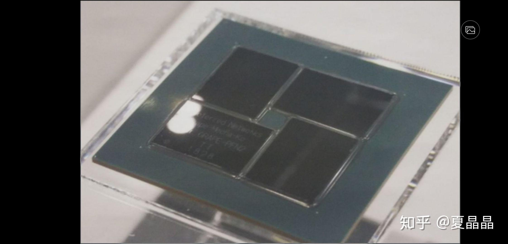
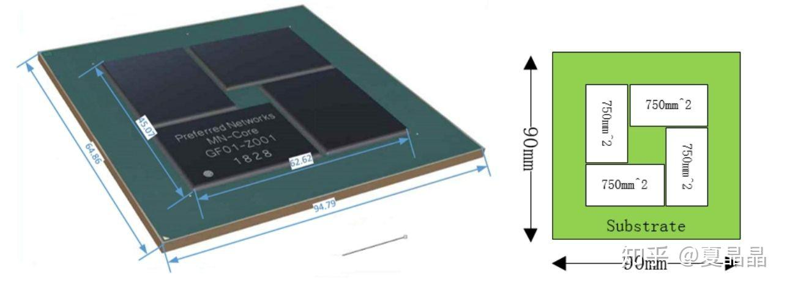

# 一个无人注意的日本芯片

> **类型**: 文章
> **作者**: Dio-晶
> **赞同**: 28
> **评论**: 4
> **时间**: 1577604642
> **原文**: [https://zhuanlan.zhihu.com/p/100040467](https://zhuanlan.zhihu.com/p/100040467)

---

这是一家今年发布信息的日本芯片

http:/[http://jun.artcompsci.org/talks/stpetersburg20190915.pdf](http://link.zhihu.com/?target=http%3A//jun.artcompsci.org/talks/stpetersburg20190915.pdf)

国内AI如火如荼，不知道为啥没人关注，默默无闻。

说起Grape，HPC领域的人都不会陌生，坚持数十年做N-body问题加速器的执着的日本人，他们一定是在造高达！！

这颗芯片的算力，是FP16 524TFLOPS，FP32 131TFLOPS，FP64 33TFLOPS。

这个算力不仅仅是世界上最大DL training算力，也是最大HPC算力了。单芯片是nvidia Volta V100的四倍。

当然，他没有针对DL某个网络的性能数据，resnet50 FPS没有的话，算力都是数字。

但这颗芯片从指标上依旧非常可怕。

微架构的简要分析如下：

而且已经有实物了。

90x90的封装，巨型chiplet。

---

*由知乎爬虫生成于 2026-02-01 15:39:01*
