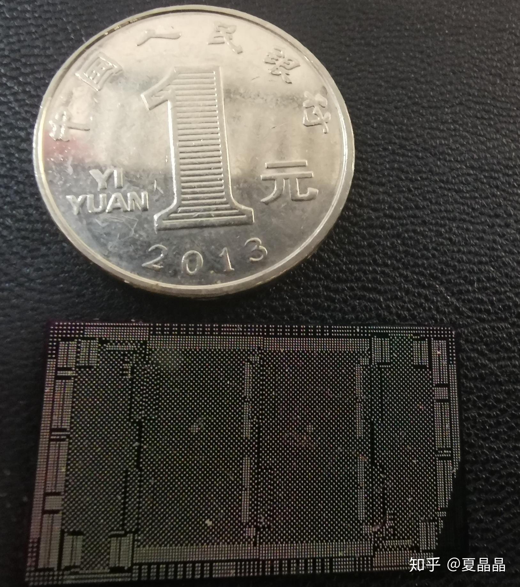
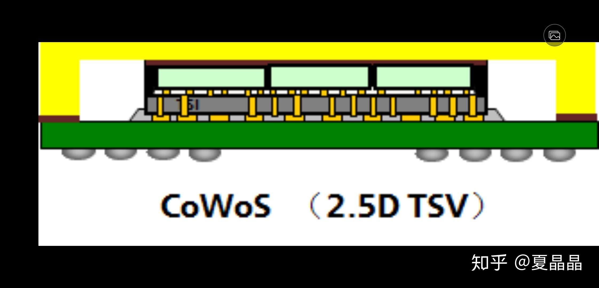
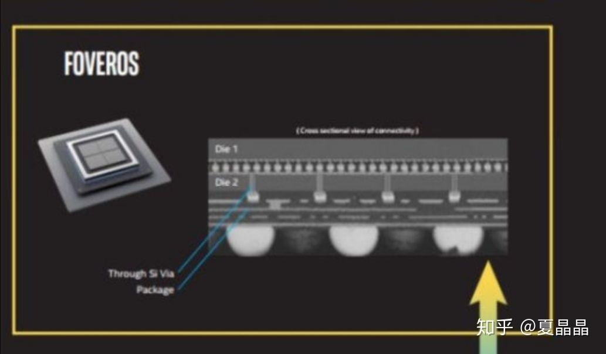
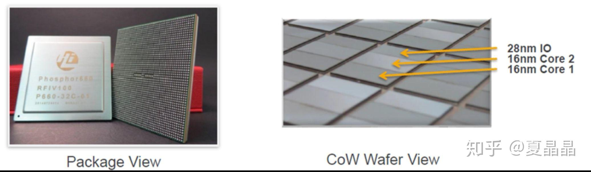
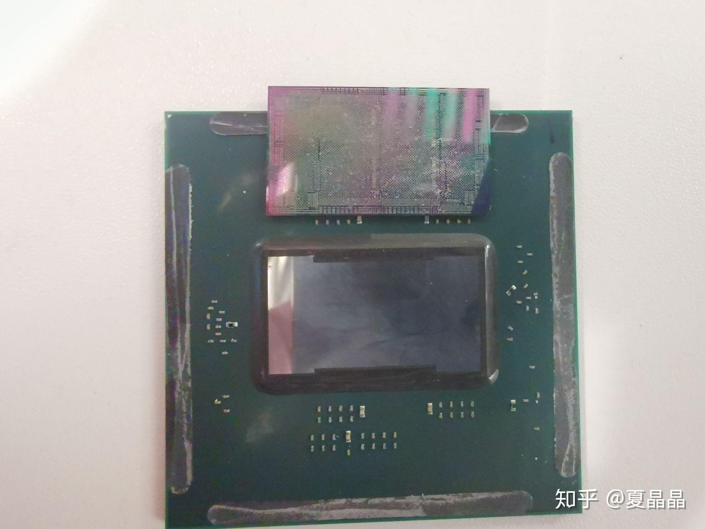

# 关于chiplet以及CoWoS

> **类型**: 文章
> **作者**: Dio-晶
> **赞同**: 172
> **评论**: 31
> **时间**: 1577602652
> **原文**: [https://zhuanlan.zhihu.com/p/100030277](https://zhuanlan.zhihu.com/p/100030277)

---

前面写过一篇关于合封技术的展望，没啥人点赞，很气 。(\*￣m￣)。

那个winnie姐姐和摩尔精英在我后面写什么chiplet的不也是一样的故事换个洋名么⊙ω⊙，哼。

[夏晶晶：合封技术会不会改变未来IC设计模式？](https://zhuanlan.zhihu.com/p/82381529)

他们肯定没有我干货多的，我再延续一下这个故事，讲得真的都是上亿的生意机会，信不信随你。国内的IC业者不要老在低端蹭来蹭去骗资本好么？

先发一张图，绝逼没几个人见过，见过的同学请举手！

啊(\*￣m￣)，不好意思，手滑了一下发错了，下面才是。

这是鲲鹏916的interposer，也就是cowos合封的底座。在chiplet的封装世界里面有三种量产可行的策略：MCM、FOP、CoWoS（Chip-on-Wafer-on-Substrate），AMD最新一代CPU采用的就是MCM，这种策略灵活、便宜，但是互联延迟和带宽都不是太好。FOP是华为独家引领世界的技术，其中的信息不能说，而CoWoS是TSMC的FAB引领的合封技术，这种技术成本最高，性能最高，业界所有采用HBM技术的合封，包括AMD的GPU都是COWOS策略。

上面的图，黄色是盖子，浅绿色是逻辑DIE，深绿色是基板，中间的灰色就是interposer了。

这是个什么玩意儿？

实际上它也是一片silicon die，但是die上没有逻辑cell，只有wire。这个die是复用TSMC某个老旧工艺（发挥余热）制作的。我照片上的interposer是废片，废点是它的位置实际上是wafer的边角，最右下角都没有能完成光照。

intel 的foveros在此基础上更进一步，在interposer上增加device逻辑，做成active interposer，所谓3D，实则2.7D。

回到主题。

不管intel，回看interposer，这是一颗只有wire & TSV的老旧工艺silicon die，其中的wire的线宽和线距，是um级别的，划重点，**um级别。**

CoWoS技术是先进技术么？ 算是吧，前几天有个燧原科技以号称国内第二家cowos设计作为宣传………

但kunpeng916使用cowos已经是2014年的事了。

上图是TSMC对外发布的， [@winnie Shao](http://www.zhihu.com/people/572947b773c0f5666d5f48855a102509) 说没找到。

真正量产的时候增加了一颗IO DIE获得更好的IO数量。

又跑偏了，回答正题。

我想说的是啥？

这个技术从2014年至今，5年了。基本上没有更进一步的技术升级，这是不正常的。很让人不满意啊。

这个interposer，是一颗silicon die，用的是非常老旧的工艺，上面只有wire和TSV。而这个wire的线宽和线距是um级别的。

为什么国内那些次级工艺的FAB，甚至做一些特殊器件之类的FAB，不来试试？ 改造一下光刻机，难度没有想象大。

而且除了成本，还有一个超越TSMC的爆点：TSMC做interposer时，其光刻设备是复用其现有老工艺流程的（这种复用对interposer是负收益），所以interposer的尺寸会受到mask尺寸33mm \* 26mm的约束，虽然能突破，但尺度依旧有限且昂贵。如果能改造一下光刻机的放大倍数。因为interposer上面没有device，不需要遵从DRC，线宽线距是um级别。做大尺度低成本interposer完成CoWoS不是梦，流程上已经try通了。

解放cowos的约束，普世化，中国的chiplet才能起飞。

---

*由知乎爬虫生成于 2026-02-01 15:39:01*
