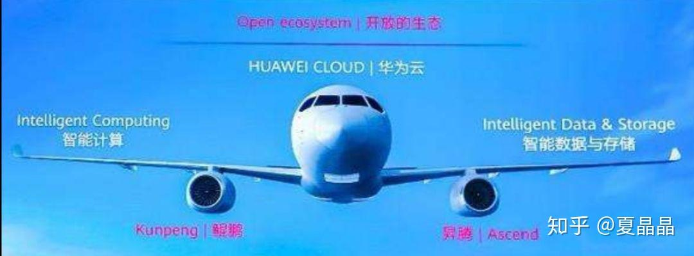

# 仰望星空……

> **类型**: 文章
> **作者**: Dio-晶
> **赞同**: 48
> **评论**: 13
> **时间**: 1571115704
> **原文**: [https://zhuanlan.zhihu.com/p/86743952](https://zhuanlan.zhihu.com/p/86743952)

---

“如果说那个原始人对宇宙的几分钟凝视是看到了一颗宝石，其后你们所谓的整个人类文明，不过是弯腰去拾它罢了。” —朝闻道

人生或是文明的目的，是为了探索宇宙的真理。这条路的终点，很有可能为之付出了一切，也终究无法到达。

作为华为鲲鹏处理器的主架构师，及昇腾处理器兼职架构师。这是我从小时候看星星开始以来坚持的梦想。刘慈欣的朝闻道非常恰当地用文字帮我表达了这种欲望，所以这段话一直以来都持续激励着我。

如果只是付出生命就能一窥宇宙的真相，那实在是太廉价了。原本，这个梦想离我还蛮远的，直到华为以鲲鹏和昇腾为核心发展计算战略。我觉得机会来了……

鲲鹏作为通用处理器代表广谱的通用计算，而昇腾提供了深度学习算法加速，AI算法其实也是一种基于统计拟合的计算方式，他用一种低纬度M的非线性方程拟合了一个超高维N的（N》M）线性方程，在大数据非精确分类识别上可以发挥巨大作用，AI前处理后的大数据，再通过高性能的科学计算，那么就有可能走向更深入的答案。

原则上完整的计算战略除了鲲鹏和昇腾，还差了两极：HPC和Graph。相信我，这并不遥远，很快完整的计算框架会逐渐完善和搭建起来。

我也很喜欢朝闻道的另一段话：

“美国总统总结道：“好了，不要再对牛弹琴了！您还看不出来这是一群怎样毫无责任心的人？还看不出这是怎样一群骗子？他们声称为全人类的利益而研究，其实只是拿社会的财富满足自己的欲望，满足他们对那种玄虚的宇宙和谐美的变态欲望，这和拿公款嫖娼有什么区别？””

房子、钞票是现实的诱惑，也不是不可以。但是梦想更深沉的。

鉴于鲲鹏处理器、昇腾处理器、以及更多计算模式的处理器的大发展之际。我们迫切需要大量人才来帮助我们达成计算产业战略，以及我个人的嫖娼梦想。

是的，这是软文，但也是真心。

我的广告：主要是鲲鹏和昇腾的华为18级（～100W）以上高端招聘，包括但不限于如下列出的各种可能的方向，长江以南地域可谈，希望在各个领域有一技之长或者经验丰富，手上积累的技术拿的出手的，怀才不遇能力没被发挥的，敢于跳一跳到上一个平台的，来嫖的。可以私信我，直接电话聊起。我这边主要是鲲鹏9系和昇腾9系，只做世界第一的东西，第二及以后的没有太大兴趣。

处理器工程工艺

处理器安全可信

处理器高端设计or验证or实现

编译器后端

SoC集成、架构

高速接口（例如PCIE or ROCEE）

时钟技术

处理器turbo技术

HPC库开发或并行计算

图计算

大型芯片项目管理

计算理论和计算误差

处理器性能建模、分析、优化

---

*由知乎爬虫生成于 2026-02-01 15:39:01*
