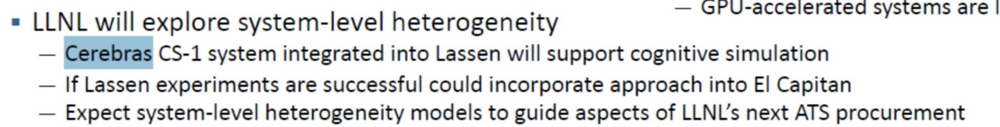
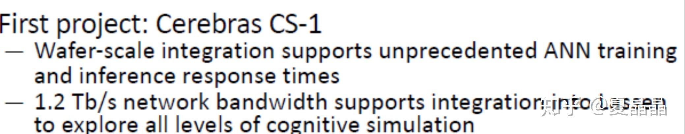
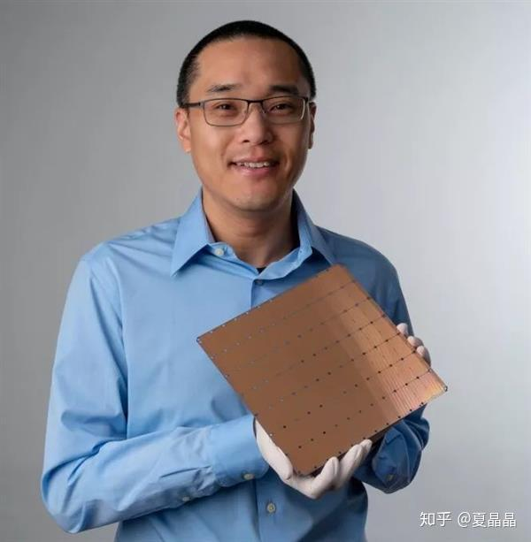

# 一点点感慨，还有羡慕

> **类型**: 文章
> **作者**: Dio-晶
> **赞同**: 162
> **评论**: 24
> **时间**: 1569143646
> **原文**: [https://zhuanlan.zhihu.com/p/83594961](https://zhuanlan.zhihu.com/p/83594961)

---

上周看到一个消息，让我感慨了好几天。

LLNL将采用cerebras搭建其下一代的超算系统Lassen，探索AI的认知能力。

LLNL，劳伦斯利弗莫尔国家实验室（Lawrence Livermore National Laboratory），是美国四大超算实室之一，在超算领域具有很重的分量，他们结合真的会创造新的世界么？

cerebras是在今年的hotchip一炮而红的，如下，脸盆一样的芯片。

在第一时间上，我作为资深的大型芯片架构师，能做出昇腾910级别顶级芯片的人，我认为cerebras是骗投资的。这种维度的技术突破具有难以想象的工程问题要解决，几乎无法商业量产。再加上他的CEO feldman也很有黑历史，他曾经的公司SeaMicro定义了一个全新的6D高密CPU集群，卖给AMD 3.4亿美元，从当前结果看AMD这个收购是彻底失败的。不得不吐槽我也是受害者，当时觉得SeaMicro这个思路很牛逼，鲲鹏910也学习了这个思路做了6D的网络互联，结果和AMD一样完败，里面坑太多了。

但即使如此，cerebras依旧得到了美国技术圈的认可，也许，这一次，一个真创造性的新系统将在USA的LLNL诞生。

世界由存量和增量两部分构成，甚至一些定义为高科技的包括INTEL X86 CPU、NVIDIA GPU在内都可以归为存量。中国依靠国家意志，市场以及人民群众的艰苦奋斗，在存量市场上相比自由经济是有优势的（鲲鹏迟早会打败intel Xeon）。如果增量持续存在，那美国吃增量，中国吃存量，并无问题。但事实上，这个世界技术的创新是减缓了，所以也才导致了中美之间的竞争。

但创新如此艰难，也更体现出其宝贵，和收益的巨大。只要有一个杰出的创新，也许就能创造出完全不同的世界。所以，作为做技术的人，当看到cerebras和LLNL将要搭建的创造性系统时，充满了感慨，和真心的羡慕。这是一种赌博，明知道具有巨大的失败可能，依旧不放弃那一点点可能成功的希望，虽然有着国家意志，但这种能够带着人类向前跳跃性挑战的冲锋，我呆在中国，也能有这样的机会吗？

想起前一段时间马云和musk的对话，牛头不对马嘴。马云是世界上最成功的存量经营的王者，而musk依旧是一个徘徊在骗子和商人之间的增量探索者。一边我熟练地用着淘宝，却并不觉得马云怎样，另一边骂着Tesla的技术不靠谱，发誓绝对不会买，但又崇拜着musk这个人的存在。真是奇妙。

也许，饱暖思淫欲，再过两年，我们也会去创造像cerebras那样系统吗吧，希望。

---

*由知乎爬虫生成于 2026-02-01 15:39:01*
